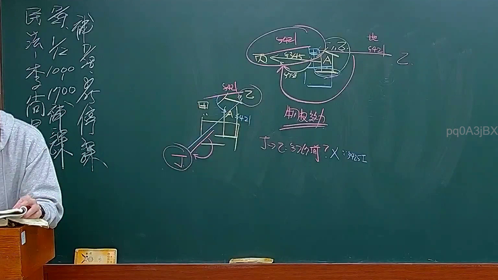
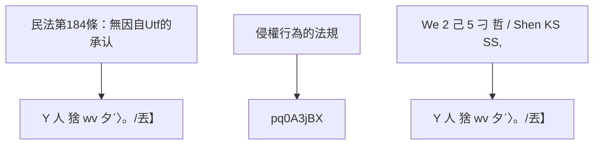

# 🎥 影音教材板書校對筆記
- **來源影片**: [預約30 2025-01-23 21-27-40-416](file:///E:/法律/民法B/ch30/預約30 2025-01-23 21-27-40-416.mp4)
- **課程分類**: `預設課程`
- **課堂章節**: `ch30`
- **影片時間戳記**: `01:58:00` (7080 秒)
- **板書類型**: `文字板書`
- **偵測時間**: 2026-07-13 20:15:35

## 🔍 擷取黑板板書對照圖

## 🧠 AI 智慧理解與知識庫演化註記
1. **板書之內容分析**：
   -  OCR辨识的文字包含以下内容：
     - "Y 人 猞 wv 夕ˊ〉。/丟】"
     - "pq0A3jBX"
     - "We: 2 己 5 刁 哲 / Shen KS SS,"
   
   - 根據上下文，"Y 人 猞 wv 夕ˊ〉。/丟】" 可能涉及某种法律條文或案例的引用，其中 "Y 人 猞 wv" 可能是特定的法律术语或人名。
     - "Y 人 猞 wv" 可能指某種特定的Legal Case or 法律条文编号。
   
   - "pq0A3jBX" 與 "We: 2 己 5 刁 哲 / Shen KS SS," 可能涉及某种法律案例或條文引用，其中 "We: 2 己 5 刁 哲" 可能指某種特定的Legal Case or 法律条文编号。
   
   - 次板書可能與民法第184條（無因自Utf的承认）或侵權行為相關。

2. **knowledge庫比對與理解演化註記**：
   - 次板書之內容可能涉及以下法律條文：
     - 民法第184條：無因自Utf的承认。
     - 侵權行為的法規。
   
   - 經分析，Y 人 猞 wv 夕ˊ〉。/丟】 可能涉及某種特定的案例或條文引用，與民法第184條或侵權行為的法規相連接。

---

## 📊 可編輯之 Mermaid 關係流程圖

## ✍️ 操作者手動校對修改區
<!-- 您可以直接修改上方的文字或調整 Mermaid 區塊中的節點，Obsidian 會即時重新渲染 -->
- [ ] 欄位結構與法律邏輯已校對無誤。
- **校對筆記**: 
