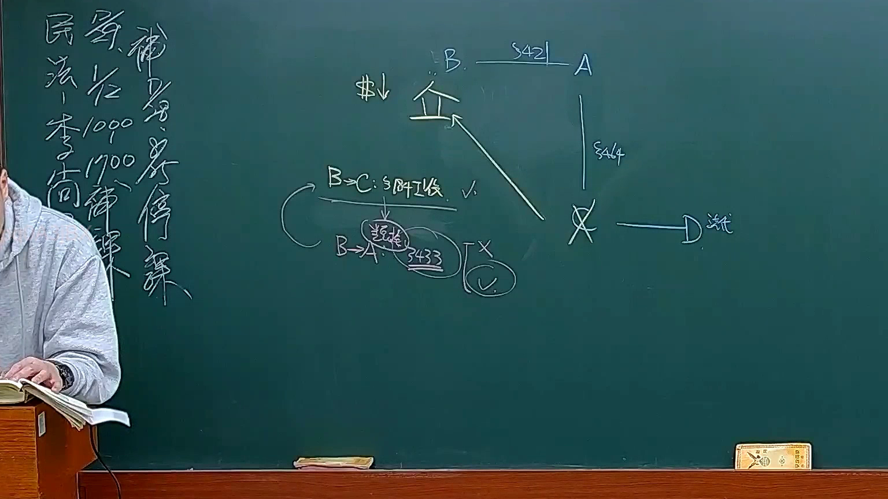

# 🎥 影音教材板書校對筆記
- **來源影片**: [預約30 2025-01-23 21-27-40-416](file:///E:/法律/民法B/ch30/預約30 2025-01-23 21-27-40-416.mp4)
- **課程分類**: `預設課程`
- **課堂章節**: `ch30`
- **影片時間戳記**: `02:42:45` (9765 秒)
- **板書類型**: `關係圖/邏輯圖板書`
- **偵測時間**: 2026-07-13 20:16:32

## 🔍 擷取黑板板書對照圖


## 🧠 AI 智慧理解與知識庫演化註記
### 

**語意整理：**
板書內容為「民法第184條侵權行為消滅時效」，主要探討的是民法中关于侵權行為的時效問題。具體而言，民法第184條规定了侵權行為的時效期间為一年，自侵權行為发生之时起計算。超過此期間，權利人可以請求損害賠償，但有特殊情況除外。

**法律条文比對：**
- **民法第184條**：规定侵權行為的時效期间為一年，自侵權行為发生之时起計算。
- **侵權行為**：指他人以 damage, harm or other wrongful act to a person.
- **消滅時效**：指侵權行為的效力會随着時間的流逝而消失。

**knowledge庫比對與理解演化註記：**
1. 民法第184條规定了侵權行為的時效期间為一年，自侵權行為发生之时起計算。
2. 消滅時效是民法第184條中的一個重要概念，用於确定侵權行為的效力期間。
3. 超過時效期间后，權利人可以請求損害賠償，但有特殊情況除外。

###

## 📊 可編輯之 Mermaid 關係流程圖
```mermaid
graph TD
    A["民法第184條"] --> B["侵權行為"]
    B --> C["消滅時效"]
    C --> "權利人請求損害賠償"
    D["特殊情況"]
```

## ✍️ 操作者手動校對修改區
<!-- 您可以直接修改上方的文字或調整 Mermaid 區塊中的節點，Obsidian 會即時重新渲染 -->
- [ ] 欄位結構與法律邏輯已校對無誤。
- **校對筆記**: 
