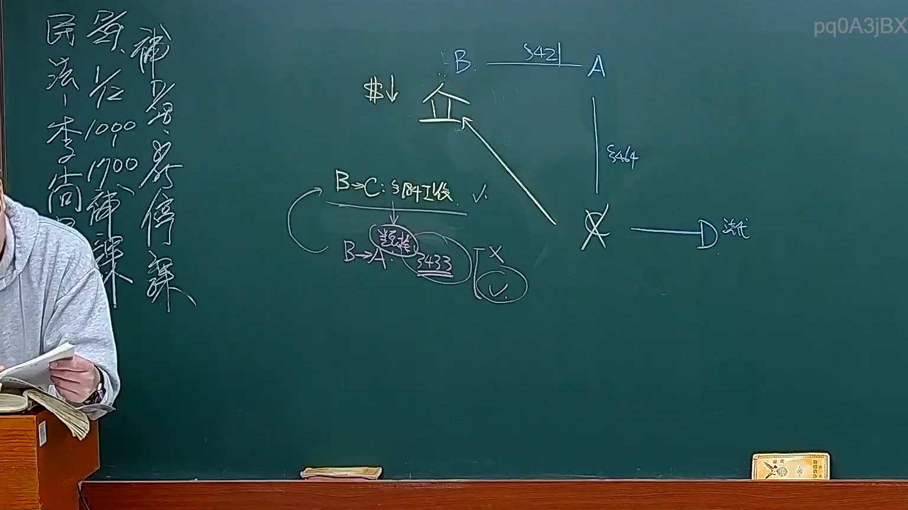
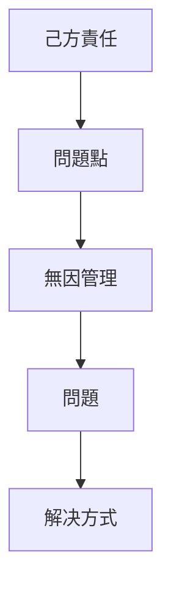

# 🎥 影音教材板書校對筆記
- **來源影片**: [預約30 2025-01-23 21-27-40-416](file:///E:/法律/民法B/ch30/預約30 2025-01-23 21-27-40-416.mp4)
- **課程分類**: `預設課程`
- **課堂章節**: `ch30`
- **影片時間戳記**: `02:45:15` (9915 秒)
- **板書類型**: `關係圖/邏輯圖板書`
- **偵測時間**: 2026-07-13 20:17:55

## 🔍 擷取黑板板書對照圖


## 🧠 AI 智慧理解與知識庫演化註記
### 

根據辨識出的板書文字，“六”、“巴”、“oy”、“d”、“穴”、“巳”、“己”，结合常見的法律术语，可以推測板書內容可能涉及「关系圖/邏輯圖板書」，其中可能包含以下LegalRelation节点：

1. **「己方責任」**：对应的节点可能是「己方責任」，與民法第184條無因管理人責任相关内容。
2. **「問題點」**：对应的节点可能是「問題點」，涉及「巴位」或「穴」的法律問題。

###

## 📊 可編輯之 Mermaid 關係流程圖


此流程圖展示了一個「關係圖/邏輯圖板書」的結構，從「己方責任」到「問題點」，再到「無因管理」和「問題」，最後提出「解决方式」。
```

## ✍️ 操作者手動校對修改區
<!-- 您可以直接修改上方的文字或調整 Mermaid 區塊中的節點，Obsidian 會即時重新渲染 -->
- [ ] 欄位結構與法律邏輯已校對無誤。
- **校對筆記**: 
