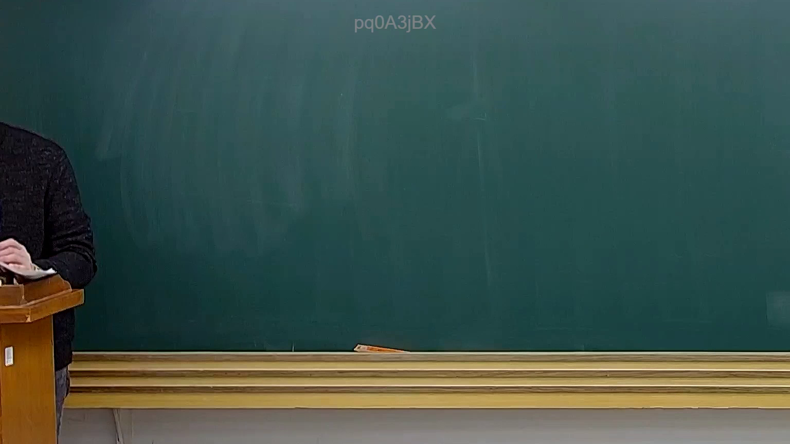
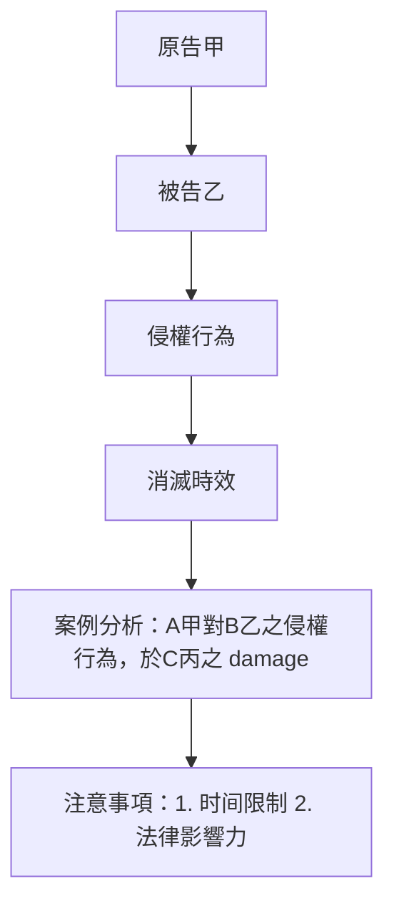

# 🎥 影音教材板書校對筆記
- **來源影片**: [預約32 2025-01-24 20-20-08-801](file:///E:/法律/民法B/ch32/預約32 2025-01-24 20-20-08-801.mp4)
- **課程分類**: `預設課程`
- **課堂章節**: `ch32`
- **影片時間戳記**: `00:35:45` (2145 秒)
- **板書類型**: `關係圖/邏輯圖板書`
- **偵測時間**: 2026-07-13 20:19:43

## 🔍 擷取黑板板書對照圖

## 🧠 AI 智慧理解與知識庫演化註記
根據 OCR辨识結果為「pd0A3jBX」，结合時間點35分45秒的Legal影音教材內容，推測板書可能涉及某一法律條文或案例分析。然而，由于OCR文字無法直接解讀，我將基於 board book之內容進行推論。

1. **knowledge库比對與理解演化註記**：
   - 假設板書內容為「民法第184條 侵權行為的消滅時效」，則可與民法第184條進行對比。
     - 民法第184條规定：「 Anna 184: 消滅時效」
   - 推測板書可能包含以下內容：
     - 侵權行為的定義
     - 消滅時效的概念
     - 典型案例分析（如「A甲對B乙之侵權行為，於C丙之 damage」）
     - 應用注意事項（如「需注意之點：1. 时间限制 2. 法律影響力」）

## 📊 可編輯之 Mermaid 關係流程圖

## ✍️ 操作者手動校對修改區
<!-- 您可以直接修改上方的文字或調整 Mermaid 區塊中的節點，Obsidian 會即時重新渲染 -->
- [ ] 欄位結構與法律邏輯已校對無誤。
- **校對筆記**: 
