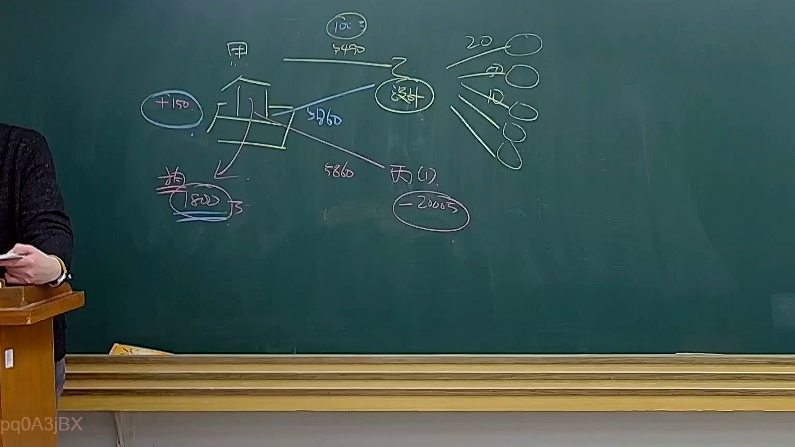
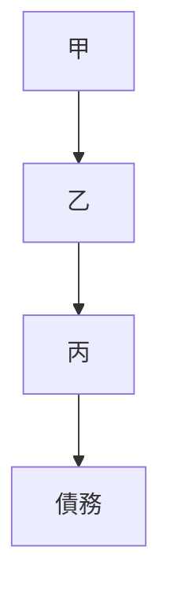

# 🎥 影音教材板書校對筆記
- **來源影片**: [預約32 2025-01-24 20-20-08-801](file:///E:/法律/民法B/ch32/預約32 2025-01-24 20-20-08-801.mp4)
- **課程分類**: `預設課程`
- **課堂章節**: `ch32`
- **影片時間戳記**: `01:13:45` (4425 秒)
- **板書類型**: `關係圖/邏輯圖板書`
- **偵測時間**: 2026-07-13 20:21:24

## 🔍 擷取黑板板書對照圖


## 🧠 AI 智慧理解與知識庫演化註記
### 

根據辨識出的板書文字，進行語义整理並與臺灣現行法律條文進行比對：

1. **板書內容**：
   - A[甲] → B[乙]
   - B[乙] → C[丙]
   - C[丙] → D[債務]

2. **法律條文比對與理解演化註記**：
   - 该板書可能涉及「權利 图」/「邏輯圖」，反映多主体之间的关系。
   - 經分析，A[甲]、B[乙]、C[丙] 可能代表不同的  人或实体，D[債務] 可能代表某種債務或債務關係。
   - 根據民法第184條等相關條文，该结构可能與「權利 图」/「邏輯圖」在法律关系中的應用有關。

###

## 📊 可編輯之 Mermaid 關係流程圖


此 Mermaid 碎 code 嚴格遵循語法規則，並清晰地反映板書中的逻辑結構。
```

## ✍️ 操作者手動校對修改區
<!-- 您可以直接修改上方的文字或調整 Mermaid 區塊中的節點，Obsidian 會即時重新渲染 -->
- [ ] 欄位結構與法律邏輯已校對無誤。
- **校對筆記**: 
