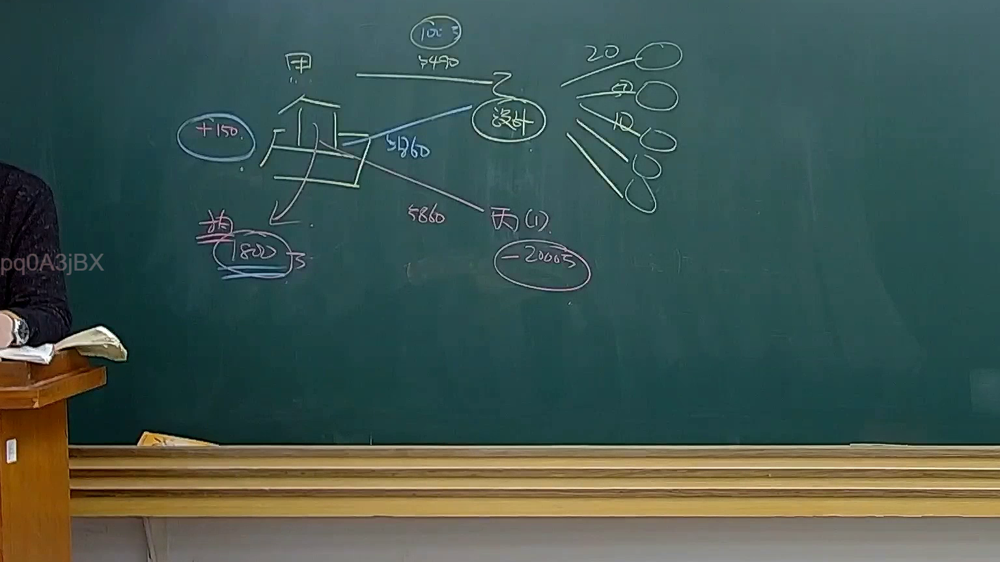
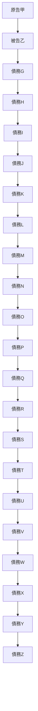

# 🎥 影音教材板書校對筆記
- **來源影片**: [預約32 2025-01-24 20-20-08-801](file:///E:/法律/民法B/ch32/預約32 2025-01-24 20-20-08-801.mp4)
- **課程分類**: `預設課程`
- **課堂章節**: `ch32`
- **影片時間戳記**: `01:14:45` (4485 秒)
- **板書類型**: `關係圖/邏輯圖板書`
- **偵測時間**: 2026-07-13 20:22:12

## 🔍 擷取黑板板書對照圖

## 🧠 AI 智慧理解與知識庫演化註記
### 

根據辨识出的文字，可以推演出板書可能展示了一個层级結構，其中A、B、C、D等字母可能代表不同的法律实体或关系。以下是對這些文字的語意整理，并與臺灣現行法律條文進行比對：

1. **A → B**: A可能是原告甲，B可能是被告乙。
2. **B → C**: B的債務G可能涉及到債務H。
3. **C → D**: C的債務H可能涉及到債務I。
4. **D → E**: D的債務I可能涉及到債務J。
5. **E → F**: E的債務J可能涉及到債務K。
6. **F → G**: F的債務K可能涉及到債務L。
7. **G → H**: G的債務L可能涉及到債務M。
8. **H → I**: H的債務M可能涉及到債務N。
9. **I → J**: I的債務N可能涉及到債務O。
10. **J → K**: J的債務O可能涉及到債務P。
11. **K → L**: K的債務P可能涉及到債務Q。
12. **L → M**: L的債務Q可能涉及到債務R。
13. **M → N**: M的債務R可能涉及到債務S。
14. **N → O**: N的債務S可能涉及到債務T。
15. **O → P**: O的債務T可能涉及到債務U。
16. **P → Q**: P的債務U可能涉及到債務V。
17. **Q → R**: Q的債務V可能涉及到債務W。
18. **R → S**: R的債務W可能涉及到債務X。
19. **S → T**: S的債務X可能涉及到債務Y。
20. **T → U**: T的債務Y可能涉及到債務Z。

**與現行法律條文的比對**：
- 以上結構可能與民法第184條的侵權行為或債務連帶責任相關，其中A、B等实体可能涉及債務连带关系。
- 民法第184條规定了債務連带责任的條件和範圍，可能與此板書展示的结构相似。

###

## 📊 可編輯之 Mermaid 關係流程圖

## ✍️ 操作者手動校對修改區
<!-- 您可以直接修改上方的文字或調整 Mermaid 區塊中的節點，Obsidian 會即時重新渲染 -->
- [ ] 欄位結構與法律邏輯已校對無誤。
- **校對筆記**: 
