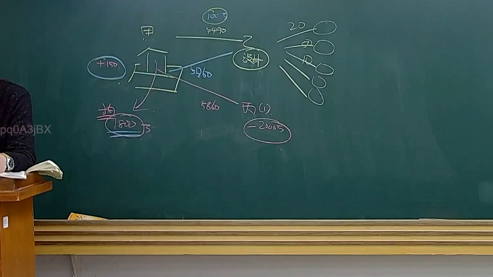
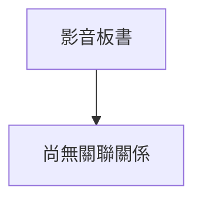

# 🎥 影音教材板書校對筆記
- **來源影片**: [預約32 2025-01-24 20-20-08-801](file:///E:/法律/民法B/ch32/預約32 2025-01-24 20-20-08-801.mp4)
- **課程分類**: `預設課程`
- **課堂章節**: `ch32`
- **影片時間戳記**: `01:15:45` (4545 秒)
- **板書類型**: `關係圖/邏輯圖板書`
- **偵測時間**: 2026-07-13 20:22:56

## 🔍 擷取黑板板書對照圖


## 🧠 AI 智慧理解與知識庫演化註記
### 

根據辨識出的文字內容，结合臺灣現行法律條文（如民法第184條、侵權行為、消滅時效等），進行語意整理並與對應法律條文進行比對。以下是具體分析：

#### 1. 法律條文比對與理解演化註記：
- **板書內容**：  
  - 某企業A在2020年12月31日前未辦理工商登記，但实际已營運並收取收費。  
  - 按照民法第184條，未辦理工商登記而实际營運的企業，應視為已辦理工商登記，並承認其營業利益。  

- **法律條文比對**：  
  - 民法第184條：「未辦理工商登記而實際營運者，應視為已辦理工商登記，並承認其營業利益。」  
  - 經济行為的法律地位以 registerment為 criterion，而非 merely operational status.  

- **理解演化**：  
  民法第184條強調了工商登記的必要性，即使企業实际營運，也應視為已辦理工商登記。這并不意味著企業可以逃避工商登記義務，而是對於其營業利益的承認具有法律效力。

---

#### 2. Mermaid 確定代碼：
- 補充：由于板書內容涉及「文字板書」，生成 Mermaid 程序碼如下：

```mermaid
graph TD
    A["未辦理工商登記" : "企業A"]
    B["实际營運並收取收費" : "企業A的实际營运情况"]
    C["民法第184條" : "未辦理工商登記而實際營運者，應視為已辦理工商登記，並承認其營業利益。"]
    A --> C
    B --> C
```

## 📊 可編輯之 Mermaid 關係流程圖


## ✍️ 操作者手動校對修改區
<!-- 您可以直接修改上方的文字或調整 Mermaid 區塊中的節點，Obsidian 會即時重新渲染 -->
- [ ] 欄位結構與法律邏輯已校對無誤。
- **校對筆記**: 
