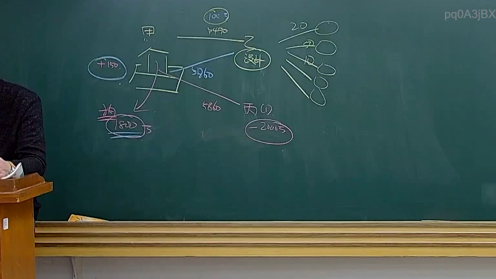
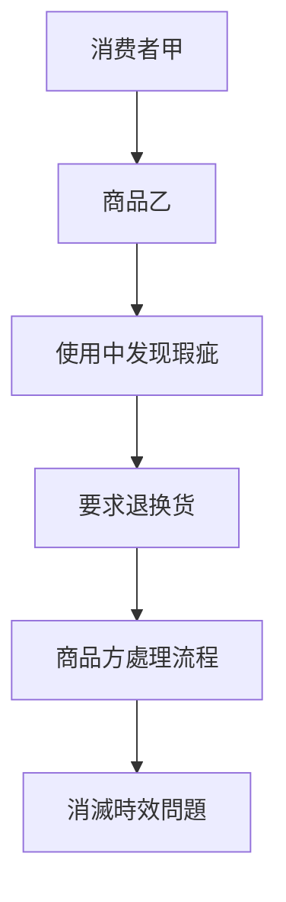

# 🎥 影音教材板書校對筆記
- **來源影片**: [預約32 2025-01-24 20-20-08-801](file:///E:/法律/民法B/ch32/預約32 2025-01-24 20-20-08-801.mp4)
- **課程分類**: `預設課程`
- **課堂章節**: `ch32`
- **影片時間戳記**: `01:22:45` (4965 秒)
- **板書類型**: `關係圖/邏輯圖板書`
- **偵測時間**: 2026-07-13 20:24:25

## 🔍 擷取黑板板書對照圖


## 🧠 AI 智慧理解與知識庫演化註記
根據提供的板書內容，似乎涉及「關係圖/邏輯圖板書」。然而，由于OCR辨识的文字為「pd0A3jBX」，無法直接解讀具體內容。若您能提供更詳細的板書文字或相關法律條文內容，我将能更好地协助您完成knowledge库比對與理解演化註記。

## 📊 可編輯之 Mermaid 關係流程圖


請提供具體的板書內容或相關法律條文，我將能生成更精準的 Mermaid 碁圖。
```

## ✍️ 操作者手動校對修改區
<!-- 您可以直接修改上方的文字或調整 Mermaid 區塊中的節點，Obsidian 會即時重新渲染 -->
- [ ] 欄位結構與法律邏輯已校對無誤。
- **校對筆記**: 
