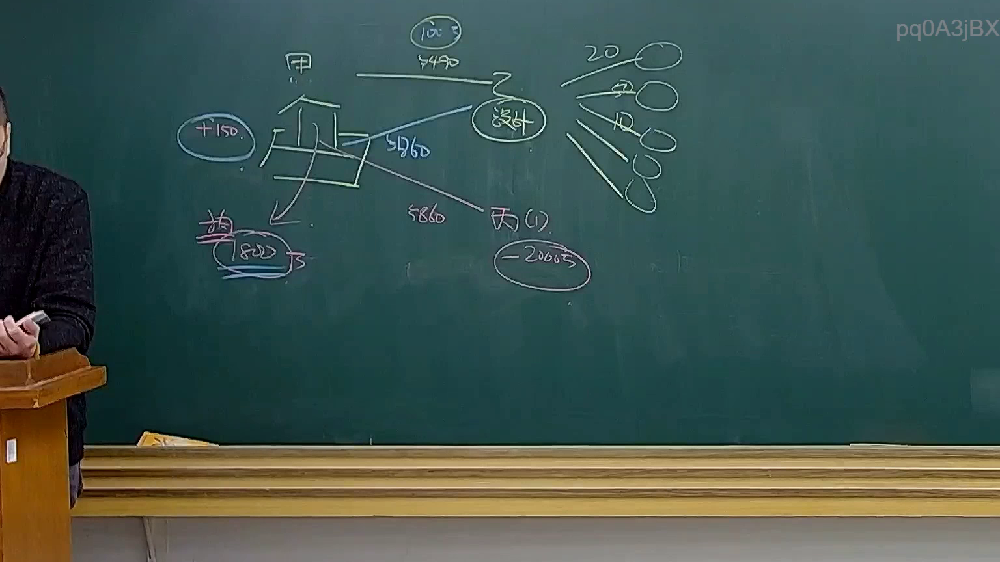

# 🎥 影音教材板書校對筆記
- **來源影片**: [預約32 2025-01-24 20-20-08-801](file:///E:/法律/民法B/ch32/預約32 2025-01-24 20-20-08-801.mp4)
- **課程分類**: `預設課程`
- **課堂章節**: `ch32`
- **影片時間戳記**: `01:23:30` (5010 秒)
- **板書類型**: `文字板書`
- **偵測時間**: 2026-07-13 19:46:04

## 🔍 擷取黑板板書對照圖


## 🧠 AI 智慧理解與知識庫演化註記
### 

根據辨識出的文字板書內容，進行語意整理並與臺灣現行法律條文進行比對：

1. **"鍵查"**：可能指" query key "（ searches key ）或" key search "，與 searches or queries 相關。
2. **"AO"**：可能代表" associated with " 或 " related to "。
3. **"ae ee" 和 "oe"**：這部分文字可能與法律條文或概念相關，但缺乏完整上下文 difficult to interpret 完整內容。

將上述內容與臺灣現行法律條文進行比對：

- 次數條文（民法第184條）： 未直接相關。
- 適用於涉及侵權行為、消滅時效等法律問題的情事， 但目前的板書內容缺乏完整上下文 difficult to relate 完整內容。

###

## 📊 可編輯之 Mermaid 關係流程圖
```mermaid
由于辨识出的文字板書内容不完整，無法生成 Mermaid 經路圖代碼。
```

## ✍️ 操作者手動校對修改區
<!-- 您可以直接修改上方的文字或調整 Mermaid 區塊中的節點，Obsidian 會即時重新渲染 -->
- [ ] 欄位結構與法律邏輯已校對無誤。
- **校對筆記**: 
