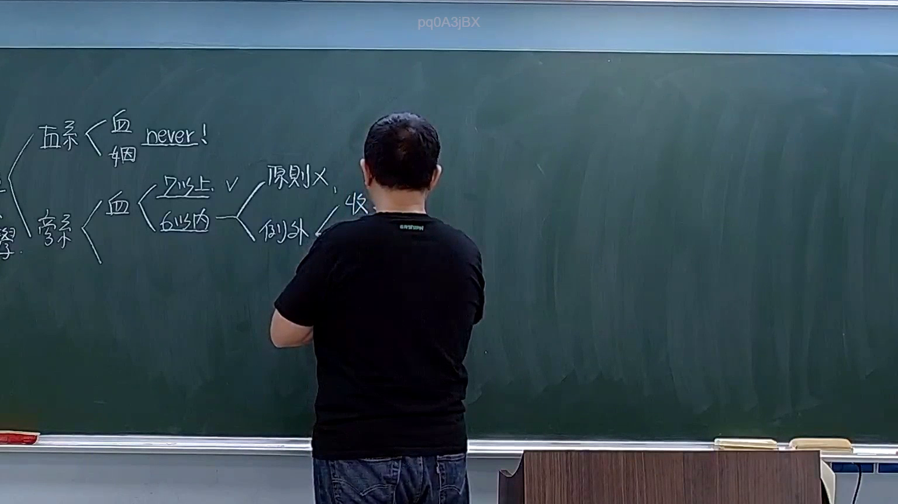

# 🎥 影音教材板書校對筆記
    - **來源影片**: [預約 1  2026-03-08 22-06-21-001](file:///H:/身分法B115/ch1/預約 1  2026-03-08 22-06-21-001.mp4)
    - **課程分類**: `[身分法B115`
    - **課堂章節**: `ch1]`
    - **影片時間戳記**: `02:13:45` (8025 秒)
    - **板書類型**: `影音板書`
    - **偵測時間**: 2026-07-21 20:47:10
    
    ## 🔍 擷取黑板板書對照圖
    
    
    ## 🧠 AI 智慧理解與知識庫演化註記
    ：
這張板書呈現的是臺灣民法親屬編中，關於「禁婚親（近親結婚之限制）」的法律邏輯架構，主要對位法條為**民法第 983 條**。

1. **OCR 內容辨識**：
   - 左側大分類：直系、旁系。
   - 直系分支：血（血親）、姻（姻親），後方標註「never!」，代表絕對禁止結婚。
   - 旁系分支：血（血親）。
   - 旁系血親細分：
     - 「7 以上 V」：指七親等以上之旁系血親，法律不禁止結婚（V 代表可行）。
     - 「6 以內」：指六親等以內之旁系血親，進一步分為：
       - 「原則 X」：原則上禁止結婚（X 代表不可行）。
       - 「例外」→「收」：指因「收養」而成立之旁系血親，若輩分相同，則為禁婚之例外（即可結婚）。

2. **法律詳細解讀與條文對照**：
   - **直系血親與直系姻親（民法 983 條第 1 項第 1 款）**：
     法律嚴格禁止直系血親與直系姻親結婚。老師在板書寫下「never!」，強調了**民法 983 條第 2 項**的規定：直系姻親間之禁婚限制，於姻親關係消滅後（如離婚或配偶死亡），「仍適用之」。這就是法律上「一旦曾為直系姻親，終身不得結婚」的學理。
   - **旁系血親（民法 983 條第 1 項第 2 款）**：
     - **原則**：旁系血親在六親等以內者不得結婚。例如兄弟姊妹（二親等）、叔侄（三親等）、堂表兄弟姊妹（四親等）。
     - **例外（收養關係）**：條文但書規定「但因收養而成立之旁系血親在六親等以內者，輩分相同者不在此限」。老師板書上的「例外」指向「收（收養）」，意指擬制血親間，若輩分相同（如養兄與養妹），法律放寬限制允許結婚，以兼顧人倫與身分穩定。
   - **親等計算（民法 968 條）**：
     板書中區分「7 以上」與「6 以內」，說明了法律僅管制到六親等以內的近親，七親等以上（如遠房表親）則無禁婚限制。
    
    ## 📊 可編輯之 Mermaid 關係流程圖
    ```mermaid
    ：
graph LR
    A["禁婚親限制 (民法 983)"] --> B["直系"]
    A --> C["旁系"]
    
    B --> B1["直系血親"]
    B --> B2["直系姻親"]
    B1 --> B3["never! (一律禁止)"]
    B2 --> B3
    
    C --> C1["血親"]
    C1 --> D["7親等以上"]
    C1 --> E["6親等以內"]
    
    D --> D1["V (允許結婚)"]
    
    E --> E1["原則 X (禁止結婚)"]
    E --> E2["例外 (因收養成立)"]
    
    E2 --> F["收 (收養且輩分相同者 V)"]
    ```
    
    ## ✍️ 操作者手動校對修改區
    <!-- 您可以直接修改上方的文字或調整 Mermaid 區塊中的節點，Obsidian 會即時重新渲染 -->
    - [ ] 欄位結構與法律邏輯已校對無誤。
    - **校對筆記**: 
    