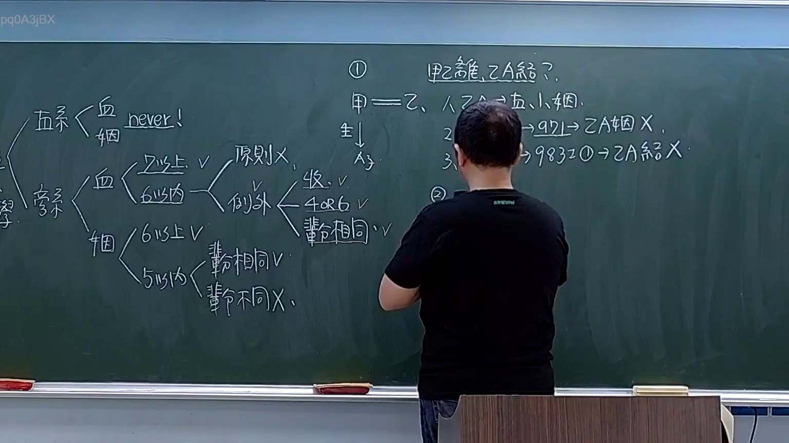

# 🎥 影音教材板書校對筆記
    - **來源影片**: [預約 1  2026-03-08 22-06-21-001](file:///H:/身分法B115/ch1/預約 1  2026-03-08 22-06-21-001.mp4)
    - **課程分類**: `[身分法B115`
    - **課堂章節**: `ch1]`
    - **影片時間戳記**: `02:20:00` (8400 秒)
    - **板書類型**: `影音板書`
    - **偵測時間**: 2026-07-21 20:47:30
    
    ## 🔍 擷取黑板板書對照圖
    
    
    ## 🧠 AI 智慧理解與知識庫演化註記
    ：
這張板書的核心在於解析臺灣《民法》親屬編關於「禁婚親」的種類與限制（民法第 983 條），以及姻親關係消滅後是否仍受禁婚限制的爭點。

1. 板書 OCR 內容辨識：
   - 左側：
     - 直系：血（never!）、姻（never!）。
     - 旁系：
       - 血：7以上 V；6以內 -> 原則 X，例外（收 V, 4 OR 6 V, 輩份相同 V）。
       - 姻：6以上 V；5以內 -> 輩份相同 V，輩份不同 X。
   - 右側（案例分析）：
     - ① 甲乙離，乙A結？
     - 甲＝乙（配偶關係），生 A子。
     - 1. 甲 -- 乙，A子 -> 乙、A 姻。
     - 2. -> 971 -> 乙A姻 X（指姻親關係消滅）。
     - 3. -> 983 I ② -> 乙A結 X。

2. 法律學理與法條對照：
   - 直系血親與直系姻親：根據民法第 983 條第 1 項第 1 款，直系血親及直系姻親間不得結婚。老師特別標註「never!」，強調這是絕對禁止，即便姻親關係因離婚而消滅（民法第 971 條），為了倫理考量，依據第 983 條第 2 項，直系姻親間之禁婚限制在姻親關係消滅後，仍有適用。
   - 旁系血親：民法第 983 條第 1 項第 2 款規定，旁系血親在六親等以內者不得結婚。但「收養」關係下的旁系血親（因收養而產生的擬制血親），若輩分相同且在四親等或六親等以外者，則是例外允許結婚的（板書標註原則 X、例外 V）。
   - 旁系姻親：民法第 983 條第 1 項第 3 款規定，五親等以內、輩分不相同者不得結婚（如叔嫂、公媳、岳婿等關係）。若輩分相同（如堂兄弟姊妹之配偶），則不在此限（板書標註輩份相同 V，輩份不同 X）。
   - 案例邏輯：甲與乙離婚後，乙想要與甲的前段婚姻所生之子 A 結婚。雖然依民法第 971 條，甲乙離婚後，乙與 A 的姻親關係消滅，但因 A 曾是乙的「直系姻親」，受民法第 983 條第 2 項規範，兩人的婚姻仍為無效。
    
    ## 📊 可編輯之 Mermaid 關係流程圖
    ```mermaid
    ：
graph TD
    Root["禁婚親限制 (民法 983)"] --> Direct["直系"]
    Root --> Collateral["旁系"]

    Direct --> DBlood["直系血親"]
    Direct --> DAffinity["直系姻親"]
    DBlood --> DBNever["絕對禁止 (Never)"]
    DAffinity --> DANever["絕對禁止 (關係消滅後亦同)"]

    Collateral --> CBlood["旁系血親"]
    Collateral --> CAffinity["旁系姻親"]

    CBlood --> CB7["7親等以上 允許 V"]
    CBlood --> CB6["6親等以內"]
    CB6 --> CB6Rule["原則 禁止 X"]
    CB6 --> CB6Except["例外 收養且輩分相同 (4或6親等) 允許 V"]

    CAffinity --> CA6["6親等以上 允許 V"]
    CAffinity --> CA5["5親等以內"]
    CA5 --> CASame["輩份相同 允許 V"]
    CA5 --> CADiff["輩份不同 禁止 X"]

    subgraph CaseStudy["案例 乙能否與前夫之子 A 結婚?"]
    A1["甲乙離婚 (971 姻親消滅)"] --> A2["乙與 A 曾具直系姻親關係"]
    A2 --> A3["適用 983 I 2 與 983 II"]
    A3 --> A4["結論 禁止結婚 X"]
    end
    ```
    
    ## ✍️ 操作者手動校對修改區
    <!-- 您可以直接修改上方的文字或調整 Mermaid 區塊中的節點，Obsidian 會即時重新渲染 -->
    - [ ] 欄位結構與法律邏輯已校對無誤。
    - **校對筆記**: 
    