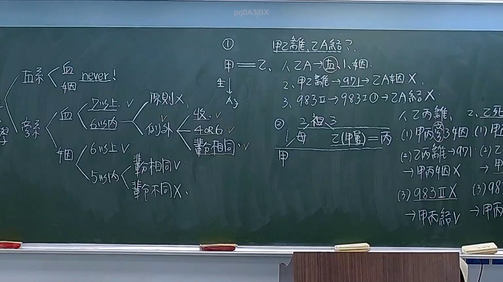

# 🎥 影音教材板書校對筆記
    - **來源影片**: [預約 1  2026-03-08 22-06-21-001](file:///H:/身分法B115/ch1/預約 1  2026-03-08 22-06-21-001.mp4)
    - **課程分類**: `[身分法B115`
    - **課堂章節**: `ch1]`
    - **影片時間戳記**: `02:25:30` (8730 秒)
    - **板書類型**: `影音板書`
    - **偵測時間**: 2026-07-21 20:47:56
    
    ## 🔍 擷取黑板板書對照圖
    
    
    ## 🧠 AI 智慧理解與知識庫演化註記
    ：

這張板書的核心主題是臺灣民法親屬編中關於「禁婚親」的法律邏輯（民法第 983 條）以及「姻親關係消滅」（民法第 971 條）對結婚限制的影響。

### 1. 板書架構 OCR 與學理對應

**A. 親屬分類與結婚限制（左側）：**
*   **直系（Lineal Relatives）：** 不論是血親（血）或姻親（姻），標註為 **"never!"**。
    *   **法條對照：** 民法第 983 條第 1 項第 1 款。直系血親與直系姻親永不得結婚。
*   **旁系（Collateral Relatives）：**
    *   **旁系血親：** 
        *   7 親等以上：可以結婚（V）。
        *   6 親等以內：原則上不可以（原則 X）。
        *   **例外（收養關係）：** 因收養而成立之旁系血親，若在 4 親等或 6 親等，且「輩分相同」，則可以結婚（V）。（對應民法第 983 條第 1 項第 2 款但書）。
    *   **旁系姻親：**
        *   6 親等以上：可以結婚（V）。
        *   5 親等以內：區分「輩分」。
            *   輩分相同：可以結婚（V）。
            *   輩分不同：不可以結婚（X）。（對應民法第 983 條第 1 項第 3 款）。

**B. 案例分析 ①：直系姻親的限制（中間）：**
*   **人物關係：** 甲與乙為夫妻，生有 A 子。
*   **爭點：** 甲乙離婚後，乙可否與甲的兒子 A 子結婚？
*   **邏輯推演：**
    1.  乙與 A 在法律上屬於直系姻親（乙是 A 的繼母或生母，此處脈絡指甲的前妻與甲子）。
    2.  根據 **民法第 971 條**，離婚會使姻親關係消滅（甲乙離 → 971 → 乙 A 姻 X）。
    3.  但根據 **民法第 983 條第 2 項**，直系姻親的結婚限制，於姻親關係消滅後「仍適用」。因此，乙 A 結婚 **(X)**，不被允許。

**C. 案例分析 ②：旁系姻親的限制與例外（右側）：**
*   **人物關係：** 乙是甲的舅舅（旁系血親 3 親等），丙是乙的妻子（甲的舅媽，屬於旁系姻親 3 親等、輩分不同）。
*   **爭點：** 若乙丙離婚或乙死亡，甲可否娶舅媽丙？
*   **邏輯推演（依板書筆記）：**
    1.  甲丙為 3 親等旁系姻親，輩分不同。
    2.  **乙丙離婚的情況：** 依 971 條姻親關係消滅。板書記錄「983 Ⅱ X」，意指此處可能在探討 983 條第 2 項在旁系姻親上的適用爭議。依現行法，旁系姻親在關係消滅後仍受限，但老師在此處標記「甲丙結 V」，可能是在解說早期實務或特定解釋下，對於「輩分不同」的旁系姻親在離婚後是否解禁的學說討論（註：現行法原則上仍禁止，但此處反映了教學中對該條文限制範圍的探討）。
    3.  **乙死亡的情況：** 姻親關係不因配偶一方死亡而消滅（除非生存配偶再婚或回歸本家），故甲丙結婚為 **(X)**。

---
    
    ## 📊 可編輯之 Mermaid 關係流程圖
    ```mermaid
    ：
graph TD
    subgraph "禁婚親基本原則"
    Direct["直系親屬"] -- "血親/姻親" --> Never["永遠禁止 (Never)"]
    CollateralBlood["旁系血親"] -- "6親等內" --> RuleX["原則禁止"]
    RuleX -- "收養且輩分相同" --> ExceptionV["例外允許 (4親等或6親等)"]
    CollateralAffinity["旁系姻親"] -- "5親等內" --> GenCheck{"輩分是否相同?"}
    GenCheck -- "相同" --> GenV["允許 (V)"]
    GenCheck -- "不同" --> GenX["禁止 (X)"]
    end

    subgraph "案例①：直系姻親"
    A1["甲"] -- "婚姻" --- B1["乙"]
    A1 -- "父子" --- C1["A子"]
    B1 -. "直系姻親" .-> C1
    Divorce1["甲乙離婚 (971條)"] --> RelationEnd["姻親關係消滅"]
    RelationEnd --> Apply983["適用 983條II項"]
    Apply983 --> Result1["乙與A子 結婚禁止 (X)"]
    end

    subgraph "案例②：旁系姻親"
    Uncle["乙 (舅舅)"] -- "婚姻" --- Aunt["丙 (舅媽)"]
    Me["甲 (外甥)"] -- "3親等血親" --- Uncle
    Me -. "3親等姻親/輩分不同" .-> Aunt
    Divorce2["乙丙離婚 (971條)"] --> Result2["板書標註 甲丙結婚 (V/爭議探討)"]
    Death2["乙死亡"] --> Result3["姻親關係存續 甲丙結婚 (X)"]
    end
    ```
    
    ## ✍️ 操作者手動校對修改區
    <!-- 您可以直接修改上方的文字或調整 Mermaid 區塊中的節點，Obsidian 會即時重新渲染 -->
    - [ ] 欄位結構與法律邏輯已校對無誤。
    - **校對筆記**: 
    