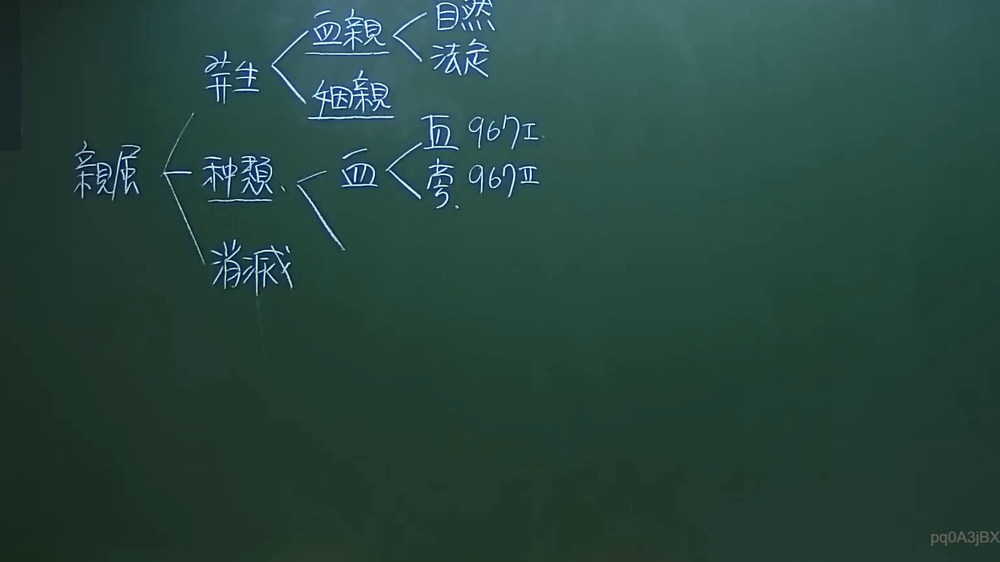

# 🎥 影音教材板書校對筆記
- **來源影片**: [預約 1 2024-09-20 16-13-31-309](file:///J:/身分法/ch1/預約 1 2024-09-20 16-13-31-309.mp4)
- **課程分類**: `[身分法`
- **課堂章節**: `ch1]`
- **影片時間戳記**: `00:05:00` (300 秒)
- **板書類型**: `影音板書`
- **偵測時間**: 2026-07-19 17:15:26

## 🔍 擷取黑板板書對照圖


## 🧠 AI 智慧理解與知識庫演化註記
：
本板書主要架構臺灣民法中有關「親屬」的法律定義與分類。
1. **親屬之發生（發生）**：依據板書，親屬關係分為「血親」與「姻親」。其中血親又細分為「自然血親」與「擬制血親」（即法擬）。
2. **血親之分類（種類）**：依據民法第967條規定，血親分為直系血親與旁系血親。
   - **民法第967條第1項**：定義直系血親（己身所從出或從己身所出之血親）。
   - **民法第967條第2項**：定義旁系血親（與己身同源於同祖父母、外祖父母之血親，但非直系血親者）。
3. **法律關聯**：此架構為學習民法親屬編的基礎，確立了親屬身分的來源與判定標準。除了發生外，板書亦提及「消滅」，即親屬關係如何終止（如離婚使姻親關係消滅，或收養關係之終止等）。

## 📊 可編輯之 Mermaid 關係流程圖
```mermaid
：
graph LR
    A["親屬"] --> B["發生"]
    A --> C["種類"]
    A --> D["消滅"]
    B --> E["血親"]
    B --> F["姻親"]
    E --> G["自然血親"]
    E --> H["擬制血親"]
    C --> I["血親"]
    I --> J["直系血親 (民法第967條第I項)"]
    I --> K["旁系血親 (民法第967條第II項)"]
```

## ✍️ 操作者手動校對修改區
<!-- 您可以直接修改上方的文字或調整 Mermaid 區塊中的節點，Obsidian 會即時重新渲染 -->
- [ ] 欄位結構與法律邏輯已校對無誤。
- **校對筆記**: 
