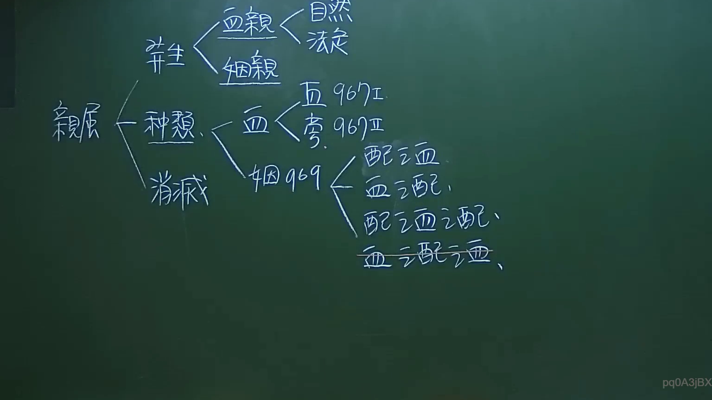

# 🎥 影音教材板書校對筆記
- **來源影片**: [預約 1 2024-09-20 16-13-31-309](file:///J:/身分法/ch1/預約 1 2024-09-20 16-13-31-309.mp4)
- **課程分類**: `[身分法`
- **課堂章節**: `ch1]`
- **影片時間戳記**: `00:06:15` (375 秒)
- **板書類型**: `影音板書`
- **偵測時間**: 2026-07-19 17:15:31

## 🔍 擷取黑板板書對照圖


## 🧠 AI 智慧理解與知識庫演化註記
：
1. **板書內容識別**：
   - 頂部結構：發生 -> 血親（自然、法定）、姻親。
   - 主軸結構：親屬 -> 種類、消滅。
   - 種類細分：
     - 血親 -> 直（直系血親 967 I）、旁（旁系血親 967 II）。
     - 姻親 -> 969 -> 配偶之血親、血親之配偶、配偶之血親之配偶、血親之配偶之血親。

2. **法律學理與法條對照**：
   - 本板書核心為我國民法關於「親屬關係」的體系分類。
   - **民法第 967 條**：定義直系血親與旁系血親。直系血親指己身所從出或從己身所出之血親；旁系血親則為非直系血親，而與己身出於同源之血親。
   - **民法第 969 條**：定義姻親。姻親之範圍包含「血親之配偶」、「配偶之血親」及「配偶之血親之配偶」。板書特別列出第四層「血親之配偶之血親」，這是依據 969 條連結展開的邏輯。
   - **法理意義**：親屬關係是身分法（親屬編）的基石，影響繼承權、扶養義務、監護權及禁止近親結婚等法律效果。例如民法第 983 條對於近親結婚的限制，即是基於此處定義的血親與姻親關係而生。

## 📊 可編輯之 Mermaid 關係流程圖
```mermaid
：
graph LR
    A["親屬"] --> B["發生"]
    A --> C["種類"]
    A --> D["消滅"]
    B --> B1["血親"]
    B --> B2["姻親"]
    B1 --> B1a["自然"]
    B1 --> B1b["法定"]
    C --> C1["血親"]
    C --> C2["姻親 (969)"]
    C1 --> C1a["直系血親 (967 I)"]
    C1 --> C1b["旁系血親 (967 II)"]
    C2 --> C2a["配偶之血親"]
    C2 --> C2b["血親之配偶"]
    C2 --> C2c["配偶之血親之配偶"]
    C2 --> C2d["血親之配偶之血親"]
```

## ✍️ 操作者手動校對修改區
<!-- 您可以直接修改上方的文字或調整 Mermaid 區塊中的節點，Obsidian 會即時重新渲染 -->
- [ ] 欄位結構與法律邏輯已校對無誤。
- **校對筆記**: 
