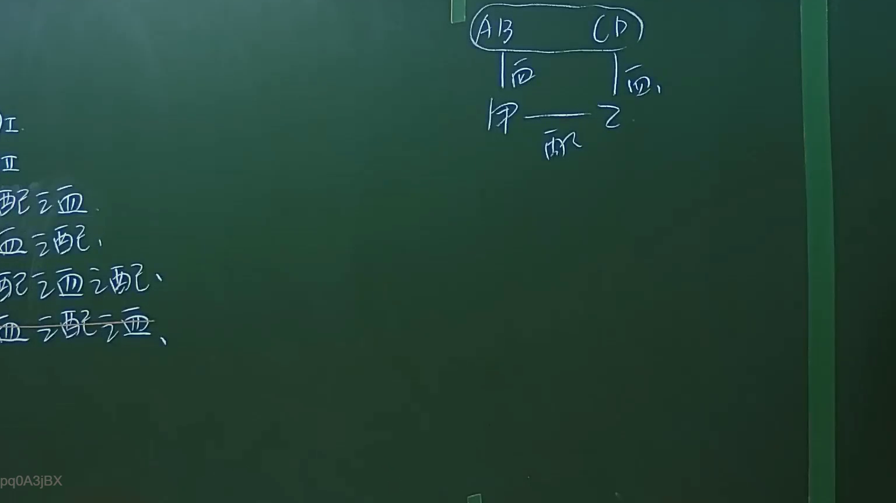

# 🎥 影音教材板書校對筆記
- **來源影片**: [預約 1 2024-09-20 16-13-31-309](file:///J:/身分法/ch1/預約 1 2024-09-20 16-13-31-309.mp4)
- **課程分類**: `[身分法`
- **課堂章節**: `ch1]`
- **影片時間戳記**: `00:07:15` (435 秒)
- **板書類型**: `影音板書`
- **偵測時間**: 2026-07-19 17:15:35

## 🔍 擷取黑板板書對照圖


## 🧠 AI 智慧理解與知識庫演化註記
：
1. **板書內容辨識**：
   - 左側條列：I、II、配血、血配、配血配、血配血。
   - 右側圖示：上方括號 (AB) 與 (CD)，下方為「甲」與「乙」，中間由「配」字連結。上方 AB 與 CD 分別對應下方甲、乙，並標註「血」字（指血親）。
2. **法學理解與應用**：
   - 此板書主要在說明民法親屬編中「親系」與「親等」的計算邏輯，特別是「配偶」與「血親」之間的關聯。
   - 「配」代表配偶（民法第967條以下有關親屬關係），「血」代表血親。
   - 老師在此處演示的是「姻親」計算方式。依據民法第969條：「稱姻親者，謂血親之配偶、配偶之血親及配偶之血親之配偶。」
   - 圖示展示了甲與乙為配偶關係，而甲與乙各自擁有自己的血親（AB 與 CD），在法律解釋上，配偶之血親（例如乙之血親 CD）與甲形成姻親關係。
   - 這些列舉（配血、血配等）是為了釐清親屬關係的類型，以便確認在法律行為（如繼承、扶養義務、迴避制度）中的具體適用對象。

## 📊 可編輯之 Mermaid 關係流程圖
```mermaid
：
graph TD
    A["AB (甲之血親)"] -- "血親關係" --- 甲["甲"]
    C["CD (乙之血親)"] -- "血親關係" --- 乙["乙"]
    甲 -- "配偶" --- 乙
    subgraph "姻親關係"
    甲 --- C
    乙 --- A
    end
```

## ✍️ 操作者手動校對修改區
<!-- 您可以直接修改上方的文字或調整 Mermaid 區塊中的節點，Obsidian 會即時重新渲染 -->
- [ ] 欄位結構與法律邏輯已校對無誤。
- **校對筆記**: 
