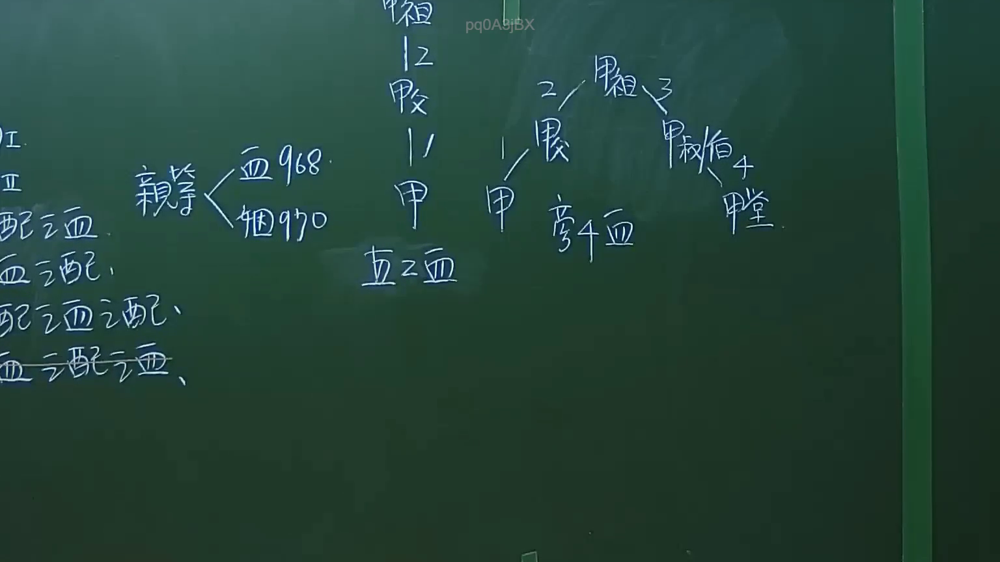

# 🎥 影音教材板書校對筆記
- **來源影片**: [預約 1 2024-09-20 16-13-31-309](file:///J:/身分法/ch1/預約 1 2024-09-20 16-13-31-309.mp4)
- **課程分類**: `[身分法`
- **課堂章節**: `ch1]`
- **影片時間戳記**: `00:11:30` (690 秒)
- **板書類型**: `影音板書`
- **偵測時間**: 2026-07-19 17:15:46

## 🔍 擷取黑板板書對照圖


## 🧠 AI 智慧理解與知識庫演化註記
：
本板書主要講授臺灣民法關於「親屬」關係與「親等」計算之法理基礎，屬於身分法（親屬編）之入門核心觀念。

1. **核心辨識文字**：
   - 「親屬」分為「血親」與「姻親」。
   - 引用條文：民法第968條（親等之計算）、民法第970條（姻親之親等）。
   - 親等圖解：展示了從「祖」開始向下計算至「父」、「甲（本人）」的垂直血親，以及向旁邊分支延伸至「伯」、「堂」等旁系血親的計算方式。
   - 包含：I.、II. 配偶血、血姻配、配血姻配、血姻配姻（部分字跡模糊處推測為姻親關係分類）。

2. **法律學理與法條對照**：
   - **民法第967條**：定義直系血親與旁系血親。板書中呈現了從共同祖先向下延伸的血親關係。
   - **民法第968條**：明確規範親等計算方式。直系血親從己身往上或往下數，一親等為一世；旁系血親則從己身往上數至同源之直系血親，再向下數至該親屬，其世數之總和即為親等。板書中標記「2」、「3」、「4」等數字，即是說明計算世數的方法。
   - **民法第970條**：姻親之親等計算，例如血親之配偶（血姻配，如媳婦、女婿）、配偶之血親（配血，如岳父母、公婆）等。

3. **重點總結**：
   此圖示教學重點在於釐清「輩分」與「親等」的差異，親等是法律上確認繼承權、扶養義務、禁婚親範圍（民法第983條）的重要依據。

## 📊 可編輯之 Mermaid 關係流程圖
```mermaid
：
graph TD
    A["祖"] -- 1 --> B["父"]
    B -- 1 --> C["甲(本人)"]
    A -- 2 --> D["伯"]
    D -- 2 --> E["堂"]
    subgraph 親等計算
    C
    B
    A
    D
    E
    end
    F["親屬"] --> G["血親 (民法968)"]
    F --> H["姻親 (民法970)"]
```

## ✍️ 操作者手動校對修改區
<!-- 您可以直接修改上方的文字或調整 Mermaid 區塊中的節點，Obsidian 會即時重新渲染 -->
- [ ] 欄位結構與法律邏輯已校對無誤。
- **校對筆記**: 
