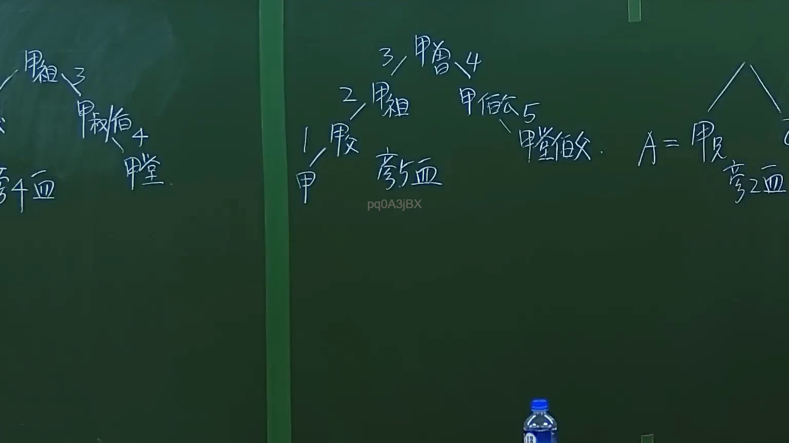

# 🎥 影音教材板書校對筆記
- **來源影片**: [預約 1 2024-09-20 16-13-31-309](file:///J:/身分法/ch1/預約 1 2024-09-20 16-13-31-309.mp4)
- **課程分類**: `[身分法`
- **課堂章節**: `ch1]`
- **影片時間戳記**: `00:14:00` (840 秒)
- **板書類型**: `影音板書`
- **偵測時間**: 2026-07-19 17:15:51

## 🔍 擷取黑板板書對照圖


## 🧠 AI 智慧理解與知識庫演化註記
：
1. 板書文字內容：
   - 透過樹狀圖結構呈現親屬關係，標示親等計算：
     1. 甲（本人）
     2. 父母
     3. 祖父母
     4. 伯叔（伯父、叔父）
     5. 堂兄弟姊妹（堂兄弟）
   - 右側另有「A = 父母」之縮寫定義，以及針對旁系血親的計算示意。
2. 法律學理與對照：
   - 本板書核心為民法關於「親等」之計算方法，依據民法第967條至第970條規定。
   - 核心邏輯：直系血親從己身向上或向下數，一世為一親等；旁系血親則須先向上數至「同源之祖先」，再向下數至該親屬。
   - 案例邏輯：
     - 甲（1）-> 父母（2）-> 祖父母（3）-> 伯叔（4）-> 堂兄弟姊妹（5）。
     - 此計算方法常見於遺產繼承（民法第1138條）、親屬關係之認定以及訴訟程序中之迴避原則。
   - 演化註記：此為親屬法基礎觀念，重點在於區分直系與旁系，並釐清親等計算之起點與終點，避免計算誤差導致遺產分配或法律地位認定錯誤。

## 📊 可編輯之 Mermaid 關係流程圖
```mermaid
：
graph TD
    A["甲(本人)"] --> B["1. 父母"]
    B --> C["2. 祖父母"]
    C --> D["3. 伯叔"]
    D --> E["4. 堂兄弟姊妹"]
    style A fill#f9f,stroke#333,stroke-width2px
    style E fill#ccf,stroke#333,stroke-width2px
```

## ✍️ 操作者手動校對修改區
<!-- 您可以直接修改上方的文字或調整 Mermaid 區塊中的節點，Obsidian 會即時重新渲染 -->
- [ ] 欄位結構與法律邏輯已校對無誤。
- **校對筆記**: 
