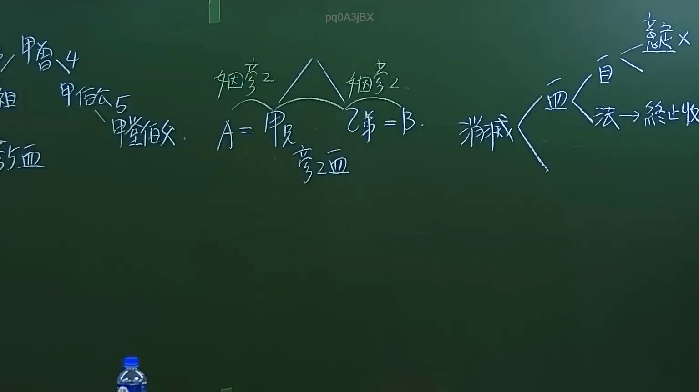

# 🎥 影音教材板書校對筆記
- **來源影片**: [預約 1 2024-09-20 16-13-31-309](file:///J:/身分法/ch1/預約 1 2024-09-20 16-13-31-309.mp4)
- **課程分類**: `[身分法`
- **課堂章節**: `ch1]`
- **影片時間戳記**: `00:17:15` (1035 秒)
- **板書類型**: `影音板書`
- **偵測時間**: 2026-07-19 17:15:57

## 🔍 擷取黑板板書對照圖


## 🧠 AI 智慧理解與知識庫演化註記
：
1. **板書內容辨識**：
   - 左側：包含親屬關係層級「曾祖」、「甲伯公」、「甲堂叔」等血親代稱。
   - 中間：核心法律架構，「婚姻」關係聯結「A（甲兄）」與「B（乙弟）」，下方註記「旁系血（親）」。
   - 右側：法律效果分析，「消滅」分支為「血（親）」與「法（律關係）」，其中「血」進一步分支為「自（然血親）」與「法（律血親）→終止收（養）」，「自」再分為「（自然）血（親）」與「（疑似）疑 ×」（註：此處應為討論自然血親與法律血親在收養終止後的法律地位差異）。

2. **法理與法條對照**：
   - 本板書探討的是親屬法中「親系」與「血親關係」之消滅。
   - **民法親屬編**：核心概念在於「直系血親」與「旁系血親」的定義，以及收養關係對血親關係的影響。
   - **民法第 1077 條**：養子女與養父母及其親屬間之關係，除法律另有規定外，與婚生子女同。
   - **民法第 1083 條**：養子女與養父母及其親屬間之關係，於收養關係終止時消滅。這解釋了板書中「法 → 終止收（養）」後法律關係消滅的邏輯。
   - **親等計算**：板書左側提及的伯公、堂叔等，涉及民法第 967 條（直系血親）及第 968 條（旁系血親親等計算），是用以區分血親關係親疏遠近的重要判斷基準。

## 📊 可編輯之 Mermaid 關係流程圖
```mermaid
：
graph TD
    A["甲兄(A)"] <-->|婚姻| B["乙弟(B)"]
    B --> C["旁系血親"]
    D["親屬關係"] --> E["消滅"]
    E --> F["血親"]
    E --> G["法律關係"]
    F --> H["自然血親"]
    F --> I["法律血親"]
    I --> J["終止收養"]
    K["曾祖"] --> L["甲伯公"]
    L --> M["甲堂叔"]
```

## ✍️ 操作者手動校對修改區
<!-- 您可以直接修改上方的文字或調整 Mermaid 區塊中的節點，Obsidian 會即時重新渲染 -->
- [ ] 欄位結構與法律邏輯已校對無誤。
- **校對筆記**: 
