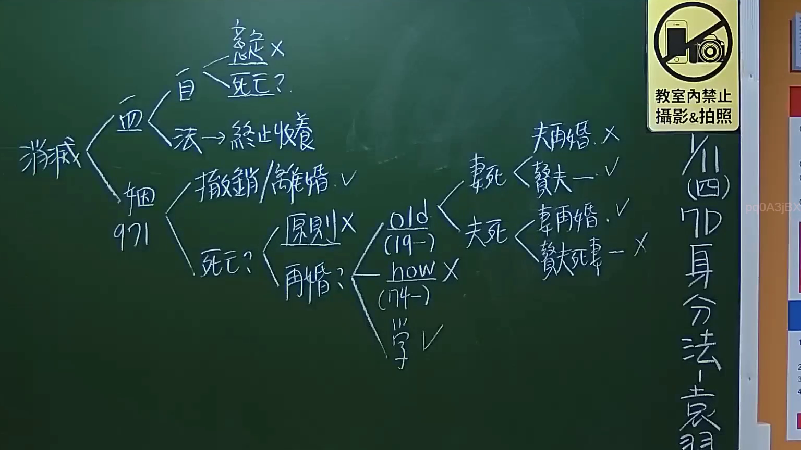

# 🎥 影音教材板書校對筆記
- **來源影片**: [預約 1 2024-09-20 16-13-31-309](file:///J:/身分法/ch1/預約 1 2024-09-20 16-13-31-309.mp4)
- **課程分類**: `[身分法`
- **課堂章節**: `ch1]`
- **影片時間戳記**: `00:28:15` (1695 秒)
- **板書類型**: `影音板書`
- **偵測時間**: 2026-07-19 17:16:05

## 🔍 擷取黑板板書對照圖


## 🧠 AI 智慧理解與知識庫演化註記
：
本板書核心議題為「身分關係之消滅」，特別聚焦於《民法》親屬編中收養與婚姻關係消滅後的法律效力及再婚限制。

1. **消滅原因分類**：
   - **血（血親/收養）**：包含「自（自然血親）」與「法（擬制血親/收養）」。針對自然血親，板書註記「死亡」及「意定（意定收養）」打叉，強調血緣關係在法律上難以隨意消滅。針對法定義制血親，特別列出「終止收養」，此對應民法第1080條以下之收養關係終止。
   - **姻（姻親/婚姻）**：指婚姻關係的消滅，列出「撤銷/離婚」。此對應民法第988條至第999-1條（婚姻之撤銷）及第1049條至第1058條（離婚）。

2. **核心爭點：死亡後的再婚限制（舊制與新說）**：
   - 當一方「死亡」後，生存配偶是否可再婚？
   - **old (19-)**：對應舊民法（民國19年制定）時期，當時對於夫妻一方死亡後，生存配偶（尤其是贅夫/贅妻）的再婚規定較為嚴格，甚至有「贅夫死妻」與「贅妻死夫」之區分。
   - **how (74-)**：對應民國74年修法後，廢除相關歧視性限制。
   - **學（學說）**：指出在解釋婚姻消滅後的法律義務時，學說已趨於保障生存配偶之身分自主權。
   - **具體情形辨析**：板書列出「夫再婚」、「贅夫」、「贅妻再婚」、「贅夫死妻」等排列組合，並以勾選（V）或打叉（X）標示法律效力之許可性，反映了親屬法從宗法制過渡至個人主義的演變。

3. **法律對照**：
   - 相關法條：民法第971條（婚約之消滅）、第1080條（收養之終止）、第1058條（離婚後財產歸屬）。

## 📊 可編輯之 Mermaid 關係流程圖
```mermaid
：
graph TD
    A["身分關係消滅"] --> B["血 (血親)"]
    A --> C["姻 (婚姻)"]
    B --> B1["自 (自然血親) - 死亡/意定 X"]
    B --> B2["法 (擬制血親) - 終止收養"]
    C --> C1["撤銷 / 離婚 V"]
    C --> C2["死亡"]
    C2 --> D["原則 X"]
    C2 --> E["再婚?"]
    E --> F["old (19年版)"]
    E --> G["how (74年版)"]
    E --> H["學說 V"]
    F --> F1["夫再婚 X"]
    F --> F2["贅夫 V"]
    F --> F3["贅妻再婚 V"]
    F --> F4["贅夫死妻 X"]
```

## ✍️ 操作者手動校對修改區
<!-- 您可以直接修改上方的文字或調整 Mermaid 區塊中的節點，Obsidian 會即時重新渲染 -->
- [ ] 欄位結構與法律邏輯已校對無誤。
- **校對筆記**: 
