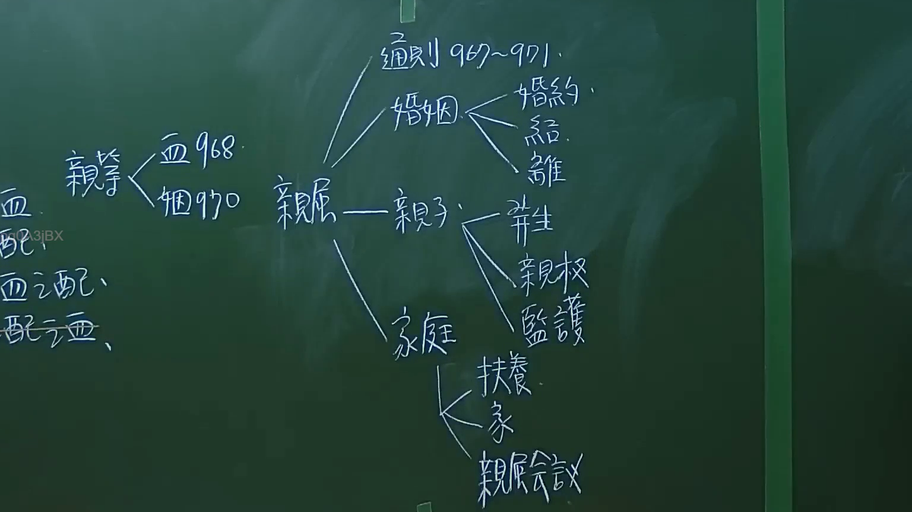

# 🎥 影音教材板書校對筆記
- **來源影片**: [預約 1 2024-09-20 16-13-31-309](file:///J:/身分法/ch1/預約 1 2024-09-20 16-13-31-309.mp4)
- **課程分類**: `[身分法`
- **課堂章節**: `ch1]`
- **影片時間戳記**: `00:34:00` (2040 秒)
- **板書類型**: `影音板書`
- **偵測時間**: 2026-07-19 17:16:11

## 🔍 擷取黑板板書對照圖


## 🧠 AI 智慧理解與知識庫演化註記
：
本板書主要呈現《民法》親屬編的架構體系。
1. **親屬定義與分類**：板書左側顯示親屬區分為「血親」（民法第968條計算親等）與「姻親」（民法第970條計算親等）。
2. **親屬編體系**：中心為「親屬」一詞，向下展開為四大範疇：
   - **通則**：民法第967條至第971條，涉及親屬之種類及親系、親等之計算。
   - **婚姻**：包括婚約、結婚、離婚。
   - **親子**：包含婚生子女推定（出生）、親權（對未成年子女之權利義務）、監護（受監護宣告或未成年人之保護）。
   - **家庭**：包含扶養義務、家（民法第1122條以下）、親屬會議（現行法已大幅修正，多數職權由法院取代）。
3. **法律條文對照**：
   - 民法第967條：親屬之定義（直系血親、旁系血親）。
   - 民法第968條：親等之計算。
   - 民法第970條：姻親之親系及親等。
   - 關於「配偶」：板書左下角提及「血、配、血之配、配之血」，這是民法判斷姻親關係範圍的關鍵邏輯。

## 📊 可編輯之 Mermaid 關係流程圖
```mermaid
：
graph TD
    A["親屬"] --> B["通則 967-971"]
    A --> C["婚姻"]
    A --> D["親子"]
    A --> E["家庭"]
    
    C --> C1["婚約"]
    C --> C2["結婚"]
    C --> C3["離婚"]
    
    D --> D1["出生"]
    D --> D2["親權"]
    D --> D3["監護"]
    
    E --> E1["扶養"]
    E --> E2["家"]
    E --> E3["親屬會議"]
    
    F["親等"] --> F1["血親 968"]
    F --> F2["姻親 970"]
```

## ✍️ 操作者手動校對修改區
<!-- 您可以直接修改上方的文字或調整 Mermaid 區塊中的節點，Obsidian 會即時重新渲染 -->
- [ ] 欄位結構與法律邏輯已校對無誤。
- **校對筆記**: 
