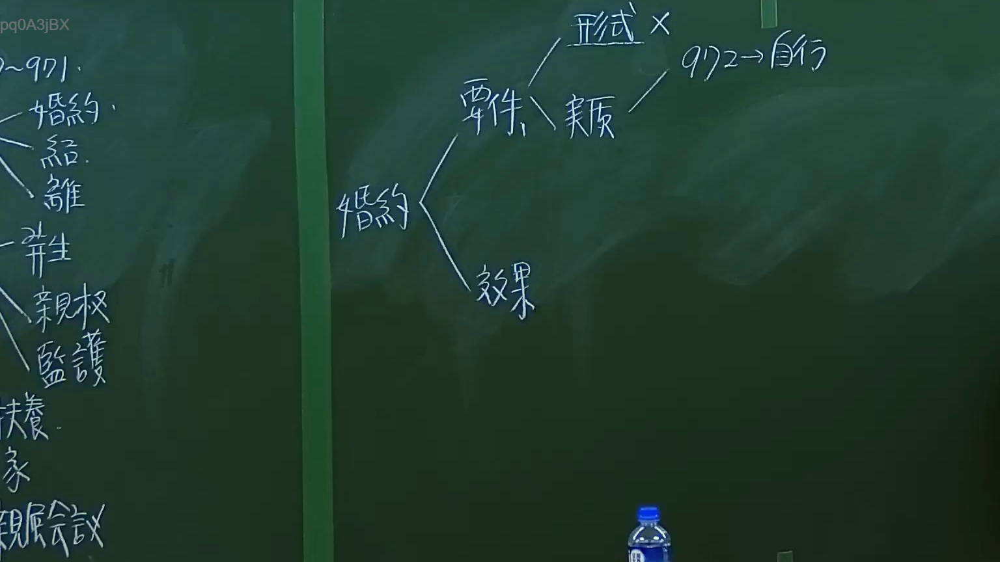

# 🎥 影音教材板書校對筆記
- **來源影片**: [預約 1 2024-09-20 16-13-31-309](file:///J:/身分法/ch1/預約 1 2024-09-20 16-13-31-309.mp4)
- **課程分類**: `[身分法`
- **課堂章節**: `ch1]`
- **影片時間戳記**: `00:37:00` (2220 秒)
- **板書類型**: `影音板書`
- **偵測時間**: 2026-07-19 17:16:16

## 🔍 擷取黑板板書對照圖


## 🧠 AI 智慧理解與知識庫演化註記
：
本次板書內容聚焦於民法親屬編中關於「婚約」的法律結構分析。老師將「婚約」拆解為「要件」與「效果」兩大核心，並進一步細分要件之構成。

1. **OCR 辨識內容**：
   - 婚約
   - 要件（下分：形式、實質）
   - 形式 x（可能指婚約無特定形式要求，或標註其非強制）
   - 實質（指向：972 -> 自行）
   - 效果

2. **法律學理與法條對照**：
   - **婚約要件**：
     - **實質要件**：板書中提到的「972 -> 自行」，對照《民法》第972條：「婚約，應由男女當事人自行訂定。」強調婚約係身分行為，具備高度的專屬性與自主性。
     - **形式要件**：板書標註「形式 x」，對應《民法》第972條之規範，婚約並無如同結婚登記般之形式要求（如書面或公開儀式），屬於不要式契約。
   - **婚約之效果**：
     - 婚約訂定後，當事人雖有結婚義務，但依法不得請求強制履行（民法第975條）。違反婚約之效果主要規範於第976條（法定解除事由）、第977條（解除婚約之效力）及第978條、第979條（損害賠償責任）。

3. **左側零星板書**：
   - 隱約可見「親權」、「監護」、「扶養」、「親屬會議」，顯示該單元為親屬法總論或婚約之延伸課程，探討身分法上各項法律關係。

## 📊 可編輯之 Mermaid 關係流程圖
```mermaid
：
graph TD
    A["婚約"] --> B["要件"]
    A --> C["效果"]
    B --> D["形式"]
    B --> E["實質"]
    D -.-> F["非要式"]
    E --> G["民法972條"]
    G --> H["當事人自行訂定"]
```

## ✍️ 操作者手動校對修改區
<!-- 您可以直接修改上方的文字或調整 Mermaid 區塊中的節點，Obsidian 會即時重新渲染 -->
- [ ] 欄位結構與法律邏輯已校對無誤。
- **校對筆記**: 
