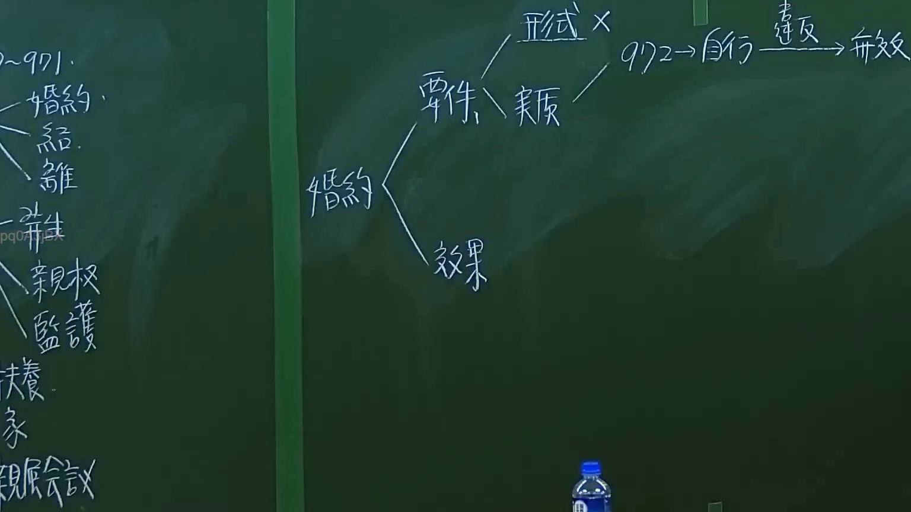

# 🎥 影音教材板書校對筆記
- **來源影片**: [預約 1 2024-09-20 16-13-31-309](file:///J:/身分法/ch1/預約 1 2024-09-20 16-13-31-309.mp4)
- **課程分類**: `[身分法`
- **課堂章節**: `ch1]`
- **影片時間戳記**: `00:38:00` (2280 秒)
- **板書類型**: `影音板書`
- **偵測時間**: 2026-07-19 17:16:20

## 🔍 擷取黑板板書對照圖


## 🧠 AI 智慧理解與知識庫演化註記
：
本板書核心探討的是臺灣民法中「婚約」的法律架構。
1. **婚約的構成要件與效力**：
   - 板書將婚約拆解為「要件」與「效果」兩大支柱。
   - 在「要件」部分，又分為「形式要件」與「實質要件」（板書簡記為「形式」與「實質」）。
   - 特別標註了「實質」部分連接至「972 -> 自行違反 -> 無效」。這裡指涉的是《民法》第972條：「婚約應由男女當事人自行訂定。」若違反此條規定，則涉及婚約效力瑕疵，導致該婚約無效（民法第973條至975條亦有相關限制）。
2. **法律條文對照**：
   - 民法第972條：規定婚約需由男女當事人自行訂定，強調親權與自主意願，排除代理。
   - 板書左側隱約可見相關親屬法概念，如「親權」、「監護」、「扶養」與「親屬會議」，呈現親屬編體系的階層性。
3. **法律邏輯**：
   - 婚約性質上為「身分契約」，非財產契約，故原則上不生強制履行之效力（民法第975條）。板書透過流程圖呈現了從要件檢驗到效力結果的判斷路徑，有助於釐清婚約訂定過程中的效力瑕疵分析。

## 📊 可編輯之 Mermaid 關係流程圖
```mermaid
：
graph TD
    A["婚約"] --> B["要件"]
    A --> C["效果"]
    B --> D["形式"]
    B --> E["實質"]
    E --> F["972 條"]
    F --> G["自行訂定"]
    G --> H["違反"]
    H --> I["無效"]
    J["親屬法相關"] -.-> A
    J --> K["親權"]
    J --> L["監護"]
    J --> M["扶養"]
    J --> N["親屬會議"]
```

## ✍️ 操作者手動校對修改區
<!-- 您可以直接修改上方的文字或調整 Mermaid 區塊中的節點，Obsidian 會即時重新渲染 -->
- [ ] 欄位結構與法律邏輯已校對無誤。
- **校對筆記**: 
