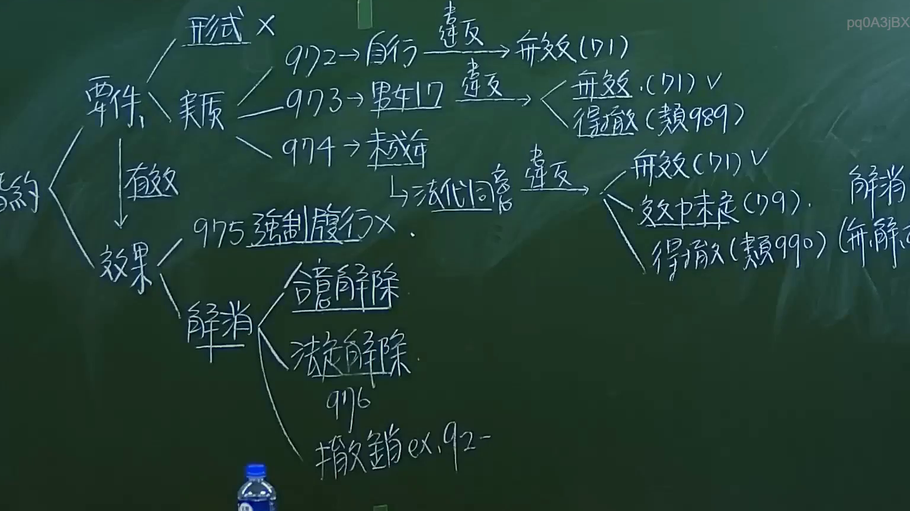

# 🎥 影音教材板書校對筆記
- **來源影片**: [預約 1 2024-09-20 16-13-31-309](file:///J:/身分法/ch1/預約 1 2024-09-20 16-13-31-309.mp4)
- **課程分類**: `[身分法`
- **課堂章節**: `ch1]`
- **影片時間戳記**: `00:59:30` (3570 秒)
- **板書類型**: `影音板書`
- **偵測時間**: 2026-07-19 17:16:33

## 🔍 擷取黑板板書對照圖


## 🧠 AI 智慧理解與知識庫演化註記
：
本板書核心在於分析臺灣《民法》親屬編關於「婚約」之相關法律規範與效力爭點。

1. **婚約之要件與違法效力（民法第972條至974條）**：
   - **形式要件**：雖未詳述，但板書提示「形式x」暗示婚約原則上無特別形式要求（亦即非要式契約）。
   - **實質要件**：
     - **972條（自行訂定）**：違反者，依民法第71條法律行為違反強制規定，應屬「無效」。
     - **973條（未成年男女需滿17歲）**：違反者，法規效力爭議多，板書指出有「無效（71條）」或「得撤銷（類推適用989條）」之見解。
     - **974條（未成年人需法代同意）**：違反此義務者，學理上有「無效（71條）」、「效力未定（119條）」或「得撤銷（類推適用990條）」之不同主張。

2. **婚約之效果（民法第975條）**：
   - 婚約不得請求強制履行（違反婚約者，他方不得請求法院判決強制結婚，以保障婚姻自由）。

3. **婚約之解消（民法第976條）**：
   - 婚約解消之方式分為：
     - **意定解除**：雙方合意解除。
     - **法定解除**：依據民法第976條規定，有特定事由（如惡意遺棄、重婚等）時，得由一方單方通知他方解除之。
     - **撤銷**：若涉及詐欺或錯誤等情事，得依民法第92條規定撤銷之。

## 📊 可編輯之 Mermaid 關係流程圖
```mermaid
：
graph TD
    A["婚約"] --> B["要件"]
    A --> C["效果"]
    B --> B1["形式"]
    B --> B2["實質"]
    B2 --> D1["972 自行訂定"]
    D1 -- "違反" --> E1["無效(71條)"]
    B2 --> D2["973 男女17歲"]
    D2 -- "違反" --> E2["無效(71條) / 得撤銷(類989)"]
    B2 --> D3["974 未成年人需法代同意"]
    D3 -- "違反" --> E3["無效(71條) / 效力未定(119) / 得撤銷(類990)"]
    C --> F1["975 強制履行(禁止)"]
    C --> F2["解消"]
    F2 --> G1["意定解除"]
    F2 --> G2["法定解除(976條)"]
    F2 --> G3["撤銷(ex 92條)"]
```

## ✍️ 操作者手動校對修改區
<!-- 您可以直接修改上方的文字或調整 Mermaid 區塊中的節點，Obsidian 會即時重新渲染 -->
- [ ] 欄位結構與法律邏輯已校對無誤。
- **校對筆記**: 
