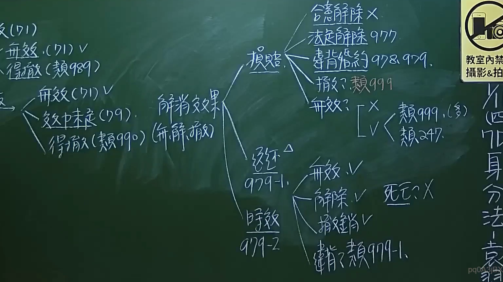

# 🎥 影音教材板書校對筆記
- **來源影片**: [預約 1 2024-09-20 16-13-31-309](file:///J:/身分法/ch1/預約 1 2024-09-20 16-13-31-309.mp4)
- **課程分類**: `[身分法`
- **課堂章節**: `ch1]`
- **影片時間戳記**: `01:07:15` (4035 秒)
- **板書類型**: `影音板書`
- **偵測時間**: 2026-07-19 17:16:41

## 🔍 擷取黑板板書對照圖


## 🧠 AI 智慧理解與知識庫演化註記
：

板書內容主要圍繞在「婚約（預約）」的相關法律效果與處理機制。老師整理了關於婚約在法律行為瑕疵（如無效、得撤銷）以及婚約解除或違反婚約時的法律責任歸屬。

1. **辨識內容**：
   - 左側：討論「預約」之法律效果，包含無效（民法971條）、得撤銷（類推民法989條）；若為婚約，則有解除與撤銷之法律效果，區分為無效、效力未定、得撤銷。
   - 右側：針對「損害賠償」（民法977、978、979條）及「返還贈與物」（民法979-1條）、「時效」（民法979-2條）進行解析。
   - 損賠部分：列舉合意解除（無）、法定解除（977）、違反婚約（978、979）、撤銷（類推999）、無效（類推999或247）。
   - 返還部分：針對婚約解除或撤銷後，贈與物之返還義務。
   - 備註：死亡不適用（死亡 X）。

2. **法條對照**：
   - 民法第971條：婚約之訂定，不得為強迫。
   - 民法第977條：法定解除婚約之損害賠償。
   - 民法第978、979條：違反婚約之損害賠償責任。
   - 民法第979-1、979-2條：婚約贈與物之返還及請求權時效。
   - 類推適用：針對法律未明文規定之情形（如撤銷、無效之損賠），透過類推適用來補強法律漏洞。

## 📊 可編輯之 Mermaid 關係流程圖
```mermaid
：

graph TD
    A["婚約法律效果"] --> B["損害賠償"]
    A --> C["返還贈與物 (979-1)"]
    A --> D["請求權時效 (979-2)"]

    B --> B1["合意解除 (X)"]
    B --> B2["法定解除 (977)"]
    B --> B3["違反婚約 (978, 979)"]
    B --> B4["撤銷 (類推 999)"]
    B --> B5["無效 (類推 999, 247)"]

    C --> C1["無效 (V)"]
    C --> C2["解除 (V)"]
    C --> C3["撤銷 (V)"]
    C --> C4["違反 (類推 979-1)"]
    C --> C5["死亡 (X)"]
```

## ✍️ 操作者手動校對修改區
<!-- 您可以直接修改上方的文字或調整 Mermaid 區塊中的節點，Obsidian 會即時重新渲染 -->
- [ ] 欄位結構與法律邏輯已校對無誤。
- **校對筆記**: 
