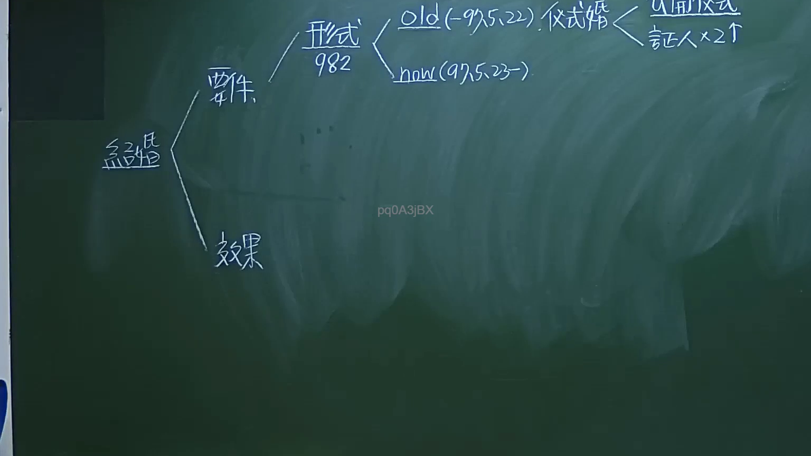

# 🎥 影音教材板書校對筆記
- **來源影片**: [預約 1 2024-09-20 16-13-31-309](file:///J:/身分法/ch1/預約 1 2024-09-20 16-13-31-309.mp4)
- **課程分類**: `[身分法`
- **課堂章節**: `ch1]`
- **影片時間戳記**: `01:11:30` (4290 秒)
- **板書類型**: `影音板書`
- **偵測時間**: 2026-07-19 17:16:47

## 🔍 擷取黑板板書對照圖


## 🧠 AI 智慧理解與知識庫演化註記
：
1. 板書文字內容：
   - 「結婚」
   - 「要件」
   - 「形式」、「982」（指民法第982條）
   - 「old (-97.5.22)」、「儀式婚」、「公開儀式」、「証人x2人」
   - 「now (97.5.23-)」
   - 「效果」

2. 法律學理與爭點：
   - 本板書核心為「結婚之要件」，重點在於解釋民法第982條關於「婚姻成立要件」之修法演變。
   - 臺灣婚姻制度於民國97年5月23日修正施行，由舊制的「儀式婚」改為「登記婚」。
   - 舊法（民法97.5.22以前）：採取「儀式婚主義」，即「結婚應有公開儀式及二人以上之證人」。
   - 新法（民法97.5.23以後）：改採「登記婚主義」，依據現行民法第982條規定：「結婚應以書面為之，有二人以上證人之簽名，並應由雙方當事人向戶政機關為結婚之登記。」
   - 此處學理重點在於「成立要件」的轉變，若未辦理登記，在新法下婚姻即不成立，而非僅是效力問題。

## 📊 可編輯之 Mermaid 關係流程圖
```mermaid
：
graph LR
    A["結婚"] --> B["要件"]
    A --> C["效果"]
    B --> D["形式 (民法 982條)"]
    D --> E["old (至 97.5.22)"]
    D --> F["now (97.5.23起)"]
    E --> G["儀式婚"]
    G --> H["公開儀式"]
    G --> I["証人 x 2"]
```

## ✍️ 操作者手動校對修改區
<!-- 您可以直接修改上方的文字或調整 Mermaid 區塊中的節點，Obsidian 會即時重新渲染 -->
- [ ] 欄位結構與法律邏輯已校對無誤。
- **校對筆記**: 
