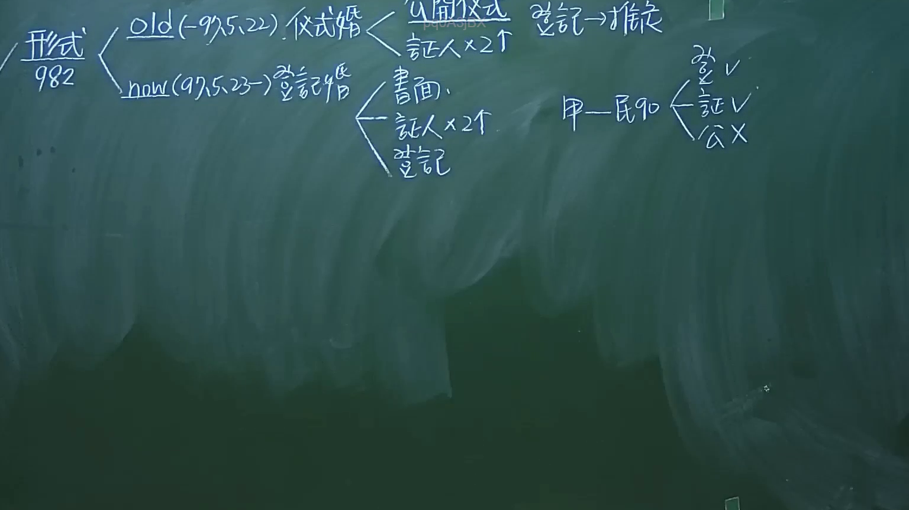

# 🎥 影音教材板書校對筆記
- **來源影片**: [預約 1 2024-09-20 16-13-31-309](file:///J:/身分法/ch1/預約 1 2024-09-20 16-13-31-309.mp4)
- **課程分類**: `[身分法`
- **課堂章節**: `ch1]`
- **影片時間戳記**: `01:16:00` (4560 秒)
- **板書類型**: `影音板書`
- **偵測時間**: 2026-07-19 17:16:54

## 🔍 擷取黑板板書對照圖


## 🧠 AI 智慧理解與知識庫演化註記
：
本板書核心在探討臺灣《民法》第982條關於「結婚形式要件」的演變及相關法律效果。

1. **OCR 文字辨識內容**：
   - 「形式 982」：指民法第982條。
   - 「old (-97.5.22) 儀式婚」：舊法時期（97年5月22日以前），結婚採儀式婚主義。要件為「公開儀式」、「證人×2人」。備註：「登記→推定」。
   - 「now (97.5.23-) 登記婚」：現行法（97年5月23日以後），採登記婚主義。要件為「書面」、「證人×2人」、「登記」。
   - 「甲—民90」：指民法第988條第1款（重婚）或相關身分行為之歸責。
   - 右側小圖示：表示結婚成立之要件檢核，「登記V、證V、公X（公開儀式非必要）」。

2. **法律學理與法條對照**：
   - **民法第982條**：現行法規定「結婚應以書面為之，有二人以上證人之簽名，並應由雙方當事人向戶政機關為結婚之登記」。此為「要式行為」，若未完成登記，婚姻關係不成立。
   - **歷史演進**：舊法時期採「儀式婚」，僅需公開儀式及二人以上證人，婚姻即告成立，登記僅具「推定」效力（即證明婚姻存在的證據）。97年修法後改採「登記婚」，將登記提升為成立要件。
   - **關聯註記**：板書中提及「民90」可能係指民法第988條關於婚姻無效之情形（例如違反982條之形式要件）。「公X」強調在現行登記婚制度下，「公開儀式」不再是法律要求的必要成立要件。

## 📊 可編輯之 Mermaid 關係流程圖
```mermaid
：
graph LR
    A["民法第982條結婚形式"] --> B["舊法時期 < 97.5.22"]
    A --> C["現行法 >= 97.5.23"]
    B --> B1["公開儀式"]
    B --> B2["證人×2人"]
    B --> B3["登記→推定效力"]
    C --> C1["書面"]
    C --> C2["證人×2人"]
    C --> C3["登記(成立要件)"]
    C --> D["檢核邏輯"]
    D --> D1["登記V"]
    D --> D2["證人V"]
    D --> D3["公開儀式X"]
```

## ✍️ 操作者手動校對修改區
<!-- 您可以直接修改上方的文字或調整 Mermaid 區塊中的節點，Obsidian 會即時重新渲染 -->
- [ ] 欄位結構與法律邏輯已校對無誤。
- **校對筆記**: 
