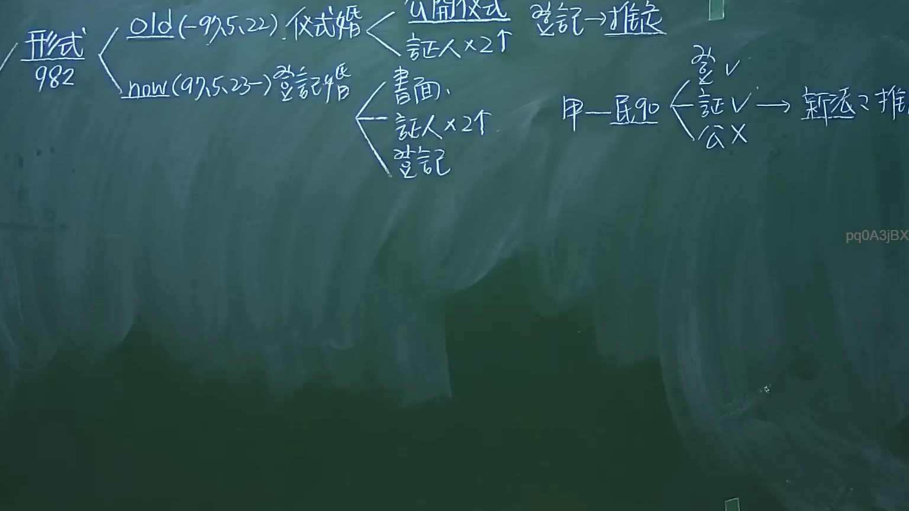

# 🎥 影音教材板書校對筆記
- **來源影片**: [預約 1 2024-09-20 16-13-31-309](file:///J:/身分法/ch1/預約 1 2024-09-20 16-13-31-309.mp4)
- **課程分類**: `[身分法`
- **課堂章節**: `ch1]`
- **影片時間戳記**: `01:17:30` (4650 秒)
- **板書類型**: `影音板書`
- **偵測時間**: 2026-07-19 17:16:59

## 🔍 擷取黑板板書對照圖


## 🧠 AI 智慧理解與知識庫演化註記
：
1. **板書內容識別**：
   - 核心主題：形式 982（指民法第 982 條關於結婚形式要件之演變）。
   - Old (-97.5.22) 儀式婚：包含「公開儀式」、「証人x2人」。註記：「登記 → 推定」。
   - Now (97.5.23-) 登記婚：包含「書面」、「証人x2人」、「登記」。
   - 民 980-982 體系下之特殊狀況辨析：「甲-民980」下的組合（登記v、証人v、公開儀式x）→ 結論：「新法之推…」（應為「新法之推定」）。

2. **法條對照與解讀**：
   - **民法第 982 條演進**：臺灣於民國 97 年 5 月 23 日進行修法，將結婚要件由「儀式婚」（形式要件為公開儀式與二人以上之證人）改為「登記婚」（形式要件為書面、二人以上證人簽名及向戶政機關登記）。
   - **推定效力**：舊法時代，縱使未辦理登記，僅具備儀式亦有效；登記僅具備「推定」效力（推定其婚姻關係成立）。
   - **法律邏輯**：板書右側探討的是當「符合登記要件，但欠缺公開儀式」時（或相反情況），在舊法與新法銜接期間的法律認定邏輯。特別是針對民法第 980 條（最低結婚年齡）及其相關形式要件的檢視，強調登記在現行法下已是「生效要件」，而非僅是「對抗要件」或「推定要件」。

## 📊 可編輯之 Mermaid 關係流程圖
```mermaid
：
graph LR
    A["民法 982 條：結婚形式要件"] --> B["舊法制度 儀式婚 (97.5.22 前)"]
    A --> C["新法制度 登記婚 (97.5.23 起)"]
    
    B --> D["公開儀式"]
    B --> E["証人 x 2"]
    B --> F["登記 → 推定"]
    
    C --> G["書面"]
    C --> H["証人 x 2"]
    C --> I["登記 (生效要件)"]
    
    J["個案討論 民 980"] --> K["登記 v"]
    J --> L["証人 v"]
    J --> M["公開儀式 x"]
    K & L & M --> N["結論 新法之推定"]
```

## ✍️ 操作者手動校對修改區
<!-- 您可以直接修改上方的文字或調整 Mermaid 區塊中的節點，Obsidian 會即時重新渲染 -->
- [ ] 欄位結構與法律邏輯已校對無誤。
- **校對筆記**: 
