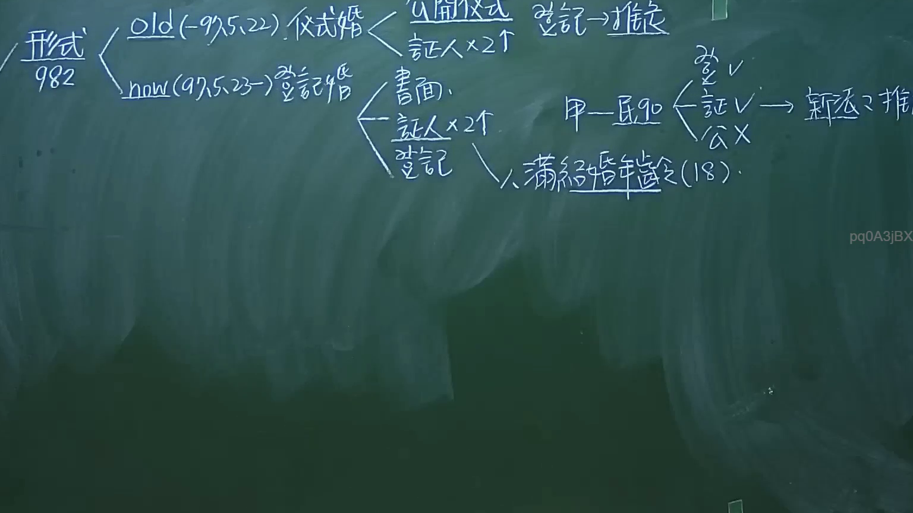

# 🎥 影音教材板書校對筆記
- **來源影片**: [預約 1 2024-09-20 16-13-31-309](file:///J:/身分法/ch1/預約 1 2024-09-20 16-13-31-309.mp4)
- **課程分類**: `[身分法`
- **課堂章節**: `ch1]`
- **影片時間戳記**: `01:19:00` (4740 秒)
- **板書類型**: `影音板書`
- **偵測時間**: 2026-07-19 17:17:04

## 🔍 擷取黑板板書對照圖


## 🧠 AI 智慧理解與知識庫演化註記
：
1. 板書文字辨識：
- 左側：形式 982
- 第一分支：old (97.5.22 前) 儀式婚 -> 公開儀式、證人x2人 -> 登記 -> 推定
- 第二分支：now (97.5.23 後) 登記婚 -> 書面、證人x2人、登記、人滿結婚年齡 (18)
- 右側案例：甲—民 982 -> 登記 v、證 v、公 x -> 新法之推定

2. 法律學理與法條對照：
- 民法第 982 條（結婚之方式）：本條於民國 97 年 5 月 23 日修正施行，我國婚姻制度由「儀式婚」正式改制為「登記婚」。
- 歷史轉折：97年5月22日以前依舊法，只要有公開儀式與二人以上證人即生效；97年5月23日以後，除需具備書面及二人以上證人外，必須向戶政機關辦理「結婚登記」，婚姻始生效力。
- 關於「推定」：板書右側提到「登記 v、證 v、公 x」，意指若欠缺公開儀式，在現行法（登記婚制度）下婚姻即不成立（無效），而非僅是推定問題。但若依舊法，登記僅具備「推定」效力。板書亦提到「滿結婚年齡（18）」，係對應民法第 980 條修正後，男女結婚年齡一致為 18 歲。

## 📊 可編輯之 Mermaid 關係流程圖
```mermaid
：
graph TD
    A["形式要件(民法982)"] --> B["舊法時期(97.5.22前)"]
    A --> C["現行法時期(97.5.23後)"]
    B --> B1["公開儀式"]
    B --> B2["證人x2人"]
    B --> B3["登記(僅具推定效力)"]
    C --> C1["書面"]
    C --> C2["證人x2人"]
    C --> C3["登記(生效要件)"]
    C --> C4["年滿18歲"]
    D["案例分析甲民法982"] --> D1["登記V"]
    D --> D2["證人V"]
    D --> D3["公開儀式X"]
    D1 & D2 & D3 --> E["新法下之婚姻效力"]
```

## ✍️ 操作者手動校對修改區
<!-- 您可以直接修改上方的文字或調整 Mermaid 區塊中的節點，Obsidian 會即時重新渲染 -->
- [ ] 欄位結構與法律邏輯已校對無誤。
- **校對筆記**: 
