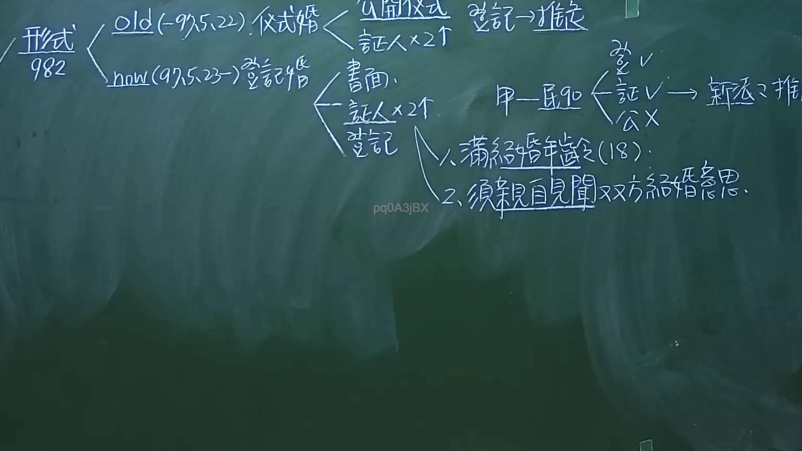

# 🎥 影音教材板書校對筆記
- **來源影片**: [預約 1 2024-09-20 16-13-31-309](file:///J:/身分法/ch1/預約 1 2024-09-20 16-13-31-309.mp4)
- **課程分類**: `[身分法`
- **課堂章節**: `ch1]`
- **影片時間戳記**: `01:20:00` (4800 秒)
- **板書類型**: `影音板書`
- **偵測時間**: 2026-07-19 17:17:10

## 🔍 擷取黑板板書對照圖


## 🧠 AI 智慧理解與知識庫演化註記
：
本板書核心在於說明臺灣民法第982條關於「結婚形式要件」的演變與現行規定：

1. **法律演變與辨識文字**：
   - 舊法時期（Old, 97年5月22日以前）：採「儀式婚」。要件為「公開儀式」與「2人以上證人」。當時登記僅具備「推定」效力（登記→推定）。
   - 現行法時期（Now, 97年5月23日以後）：改採「登記婚」。要件為「書面」、「2人以上證人」以及最重要的「向戶政機關辦理結婚登記」。

2. **法律條文對照**：
   - 民法第982條：「結婚應以書面為之，有二人以上證人之簽名，並應由雙方當事人向戶政機關為結婚之登記。」
   - 板書中提及「民法982」的構成要件，包含：(1) 滿結婚年齡（18歲，依現行民法第980條）；(2) 須親自見聞雙方結婚意思。
   - 關於「證人」的效力：板書指出「登記Ｖ、證人Ｖ、公開Ｘ」，強調現行法下，結婚之生效與否以「登記」為必要，公開儀式已非要件。

3. **法律邏輯註記**：
   - 老師強調了「新法之推定」邏輯，即在登記婚制度下，登記為生效要件，若未辦理登記，即便有公開儀式亦不發生法律上婚姻效力（屬於無效婚姻）。

## 📊 可編輯之 Mermaid 關係流程圖
```mermaid
：
graph TD
    A["民法第982條結婚形式"] --> B["舊法 (97.5.22前) 儀式婚"]
    A --> C["現行法 (97.5.23後) 登記婚"]
    
    B --> B1["公開儀式"]
    B --> B2["證人 x 2"]
    B --> B3["登記 -> 推定力"]
    
    C --> C1["書面"]
    C --> C2["證人 x 2"]
    C --> C3["登記 (生效要件)"]
    
    C3 --> D["構成要件與實務"]
    D --> D1["滿結婚年齡 (18歲)"]
    D --> D2["須親自見聞雙方結婚意思"]
```

## ✍️ 操作者手動校對修改區
<!-- 您可以直接修改上方的文字或調整 Mermaid 區塊中的節點，Obsidian 會即時重新渲染 -->
- [ ] 欄位結構與法律邏輯已校對無誤。
- **校對筆記**: 
