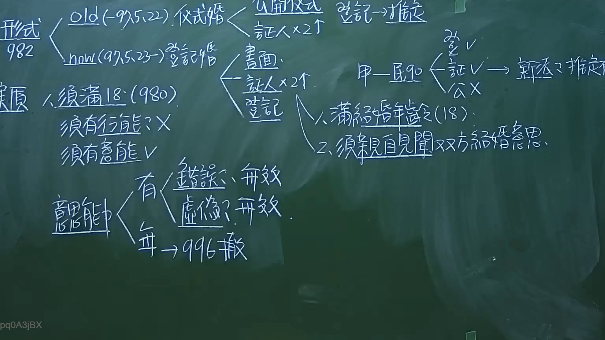

# 🎥 影音教材板書校對筆記
- **來源影片**: [預約 1 2024-09-20 16-13-31-309](file:///J:/身分法/ch1/預約 1 2024-09-20 16-13-31-309.mp4)
- **課程分類**: `[身分法`
- **課堂章節**: `ch1]`
- **影片時間戳記**: `01:27:00` (5220 秒)
- **板書類型**: `影音板書`
- **偵測時間**: 2026-07-19 17:17:18

## 🔍 擷取黑板板書對照圖


## 🧠 AI 智慧理解與知識庫演化註記
：
本板書核心在於闡述臺灣民法關於「婚姻要件」的規定，特別是區分「形式要件」與「實質要件」，並點出民國 97 年 5 月 23 日修正前後的法律演變。

1. 形式要件：
   - 舊法（97.5.22 前）：依舊民法第 982 條，採取「儀式婚」，須有公開儀式及二人以上之證人，登記僅具「推定」效力。
   - 新法（97.5.23 起）：現行民法第 982 條改採「登記婚」，須以書面為之、有二人以上證人簽名，並向戶政機關辦理結婚登記，登記始為生效要件。

2. 實質要件：
   - 年齡：依民法第 980 條，男女須滿 18 歲（配合民法成年年齡調降，此處亦修正為 18 歲）。
   - 意思能力：板書特別探討「意思能力」，指出婚姻行為須有意思能力，若無（如精神障礙致無識別能力）則可能無效。
   - 意思表示瑕疵：若有錯誤或虛偽（假結婚），依民法第 996 條規定，得請求撤銷。

3. 關鍵條文聯想：
   - 民法第 980 條：男女未滿 18 歲者，不得結婚。
   - 民法第 982 條：結婚應以書面為之，有二人以上證人之簽名，並應由雙方當事人向戶政機關為結婚之登記。
   - 民法第 996 條：當事人之一方，於結婚時係在無意識或精神錯亂中者，得向法院請求撤銷之。

## 📊 可編輯之 Mermaid 關係流程圖
```mermaid
：
graph TD
    A["婚姻要件"] --> B["形式要件"]
    A --> C["實質要件"]
    B --> D["舊法 儀式婚 (97.5.22前)"]
    D --> D1["公開儀式"]
    D --> D2["證人 x 2"]
    D --> D3["登記(推定)"]
    B --> E["新法 登記婚 (97.5.23後)"]
    E --> E1["書面"]
    E --> E2["證人 x 2"]
    E --> E3["登記(生效)"]
    C --> F["年齡 須滿18歲(民法980)"]
    C --> G["意思能力"]
    G --> H["有意思能力(有效)"]
    G --> I["無意思能力(無效)"]
    I --> J["錯誤(無效)"]
    I --> K["虛偽(無效)"]
    G --> L["意思表示瑕疵(民法996 撤銷)"]
```

## ✍️ 操作者手動校對修改區
<!-- 您可以直接修改上方的文字或調整 Mermaid 區塊中的節點，Obsidian 會即時重新渲染 -->
- [ ] 欄位結構與法律邏輯已校對無誤。
- **校對筆記**: 
