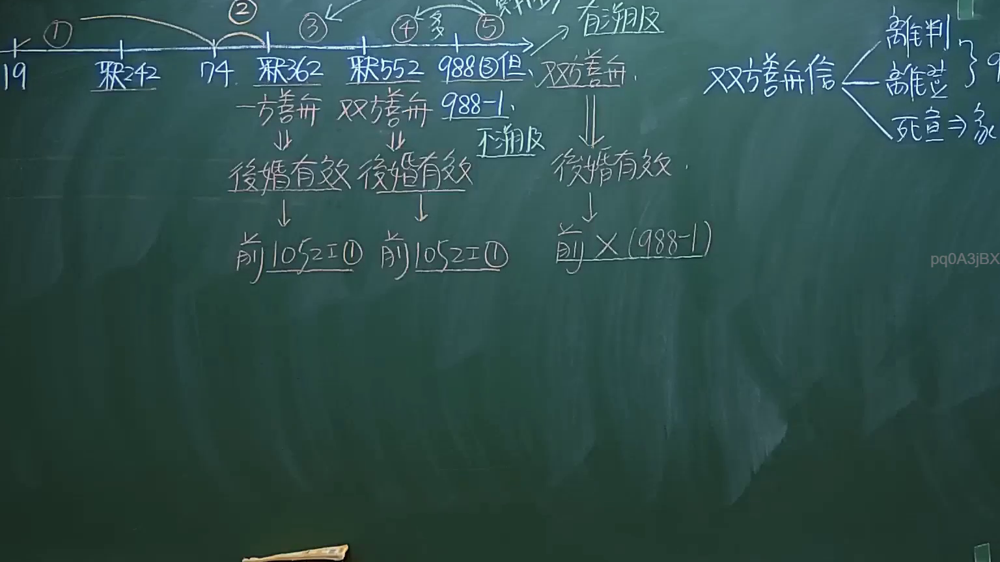

# 🎥 影音教材板書校對筆記
- **來源影片**: [預約 1 2024-09-20 16-13-31-309](file:///J:/身分法/ch1/預約 1 2024-09-20 16-13-31-309.mp4)
- **課程分類**: `[身分法`
- **課堂章節**: `ch1]`
- **影片時間戳記**: `02:12:30` (7950 秒)
- **板書類型**: `影音板書`
- **偵測時間**: 2026-07-19 17:17:40

## 🔍 擷取黑板板書對照圖


## 🧠 AI 智慧理解與知識庫演化註記
：

本板書主要闡述臺灣民法關於「重婚」效力及相關法律爭點之處理機制。根據《民法》第988條第3款之規定，重婚無效，但同法第988條之1設有例外規定。

1. **辨識內容**：
   - 時間軸標記：①（19歲，涉及民法第980條）、74（應指《民法》第74條）、988條第3款但書、988-1條。
   - 關於善意信賴之處理：
     - 一方善意：後婚有效，適用《民法》第1052條第1項第1款（重婚為裁判離婚事由）。
     - 雙方善意：後婚有效，不溯及既往。
   - 區分「離婚」、「離登」（離婚登記）及「死宣」（死亡宣告）。

2. **法條對照與法律邏輯**：
   - **重婚無效（民法§988 III）**：原則上重婚無效，旨在保障一夫一妻制。
   - **例外規定（民法§988-1）**：前婚關係已消滅（如離婚、配偶死亡、死亡宣告），當事人對婚姻效力有誤認，若雙方善意，後婚得維持有效。
   - **善意之判斷**：板書區分了「一方善意」與「雙方善意」的法律效果。
     - 若為「一方善意」，則後婚原則上維持有效，但仍可成為前婚配偶請求離婚之法定事由（民法§1052 I ①）。
     - 若為「雙方善意」，根據 §988-1，後婚有效，且不溯及既往。
   - **實務關聯**：板書右側提及「離判」（裁判離婚）、「離登」（離婚登記）、「死宣」（死亡宣告），這些皆為前婚關係消滅的法定情境，是認定重婚是否符合 §988-1 例外條款的前提要件。

## 📊 可編輯之 Mermaid 關係流程圖
```mermaid
：
graph TD
    A["重婚效力判定"] --> B{"前婚狀態"}
    B --> C["一方善意"]
    B --> D["雙方善意"]
    C --> E["後婚有效"]
    D --> F["後婚有效 (不溯及)"]
    E --> G["民法1052條第1項第1款 構成裁判離婚事由"]
    F --> H["民法988條之1 維持婚姻效力"]
    I["前婚消滅事由"] --> J["裁判離婚"]
    I --> K["離婚登記"]
    I --> L["死亡宣告"]
    J & K & L -.-> B
```

## ✍️ 操作者手動校對修改區
<!-- 您可以直接修改上方的文字或調整 Mermaid 區塊中的節點，Obsidian 會即時重新渲染 -->
- [ ] 欄位結構與法律邏輯已校對無誤。
- **校對筆記**: 
