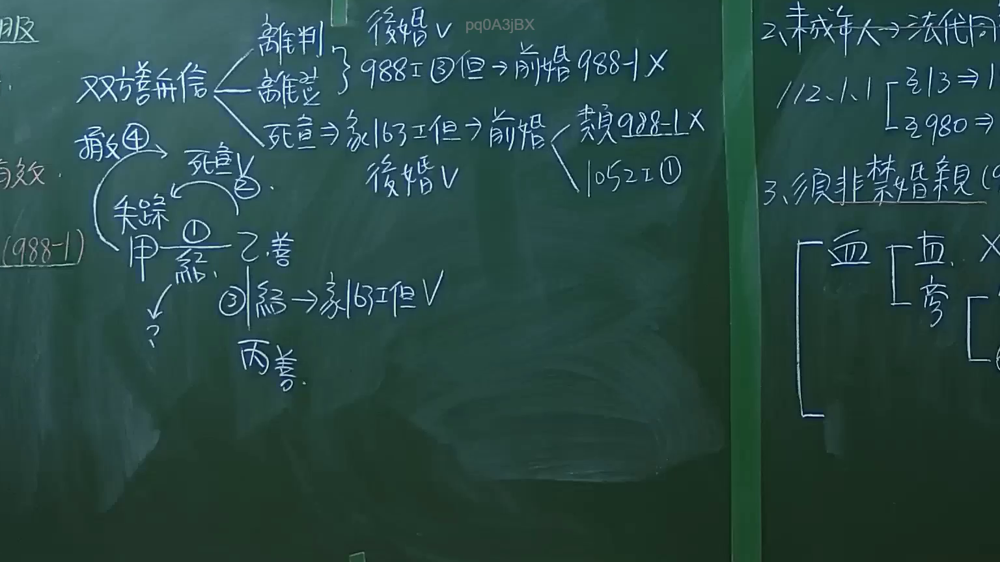

# 🎥 影音教材板書校對筆記
- **來源影片**: [預約 1 2024-09-20 16-13-31-309](file:///J:/身分法/ch1/預約 1 2024-09-20 16-13-31-309.mp4)
- **課程分類**: `[身分法`
- **課堂章節**: `ch1]`
- **影片時間戳記**: `02:15:30` (8130 秒)
- **板書類型**: `影音板書`
- **偵測時間**: 2026-07-19 17:17:48

## 🔍 擷取黑板板書對照圖


## 🧠 AI 智慧理解與知識庫演化註記
：
此板書主要探討我國親屬法中關於「重婚」之效力，特別是針對「善意無過失」當事人（雙方善信）的保護規定，涉及民法第 988 條、第 988-1 條及第 1052 條等爭點。

1. **核心概念辨識**：
   - 「雙方善信」：指重婚之雙方當事人均不知前婚姻關係仍存續，善意且無過失。
   - 「後婚 V」：指重婚之婚姻被認為有條件有效或受法律保障。
   - 「988-1」：民法第 988-1 條，針對重婚者，若後婚當事人善意且無過失，保護其婚姻效力之特別規定。
   - 「死宣」：宣告死亡。若當事人被宣告死亡後再婚，即便隨後撤銷死亡宣告，其後婚之效力依民法第 163 條但書保護。
   - 「失蹤」與「甲、乙、丙」：說明當事人在失蹤期間發生之法律關係，以及若後婚當事人（乙、丙）為善意時的法律效果。
   - 右側板書補充：提及「未成年人須法定代理人同意」、「禁止結婚親屬」（血親、旁系血親等限制）。

2. **法條對照與邏輯演化**：
   - **民法第 988 條第 3 款**：原則上重婚為無效，但同條第 1 款、第 2 款設有除外規定。
   - **民法第 988-1 條**：立法目的在於保護信賴登記及善意第三人。若後婚當事人善意且無過失，即使前婚姻（或死亡宣告）有後續變動，亦不影響該後婚之效力（後婚 V）。
   - **民法第 163 條但書**：死亡宣告撤銷後，原配偶再婚者，其再婚效力不因撤銷而受影響。
   - **類推適用**：板書中提到「類 988-1」，顯示在某些類似重婚之結構下，司法實務傾向類推適用此條款以衡平善意當事人之權益。

## 📊 可編輯之 Mermaid 關係流程圖
```mermaid
：
graph TD
    A["雙方善信"] --> B{"法律狀態"}
    B --> C["離判(離婚/判決)"]
    B --> D["死宣(死亡宣告)"]
    C --> E["988-1項3款(但書)"]
    E --> F["後婚有效(V)"]
    D --> G["民法163條但書"]
    G --> H["後婚有效(V)"]
    H --> I["類推適用988-1"]
    I --> J["民法1052條1項"]
    K["未成年人"] --> L["需法定代理人同意"]
    M["禁婚親屬"] --> N["血親限制"]
    N --> O["直系血親"]
    N --> P["旁系血親"]
```

## ✍️ 操作者手動校對修改區
<!-- 您可以直接修改上方的文字或調整 Mermaid 區塊中的節點，Obsidian 會即時重新渲染 -->
- [ ] 欄位結構與法律邏輯已校對無誤。
- **校對筆記**: 
