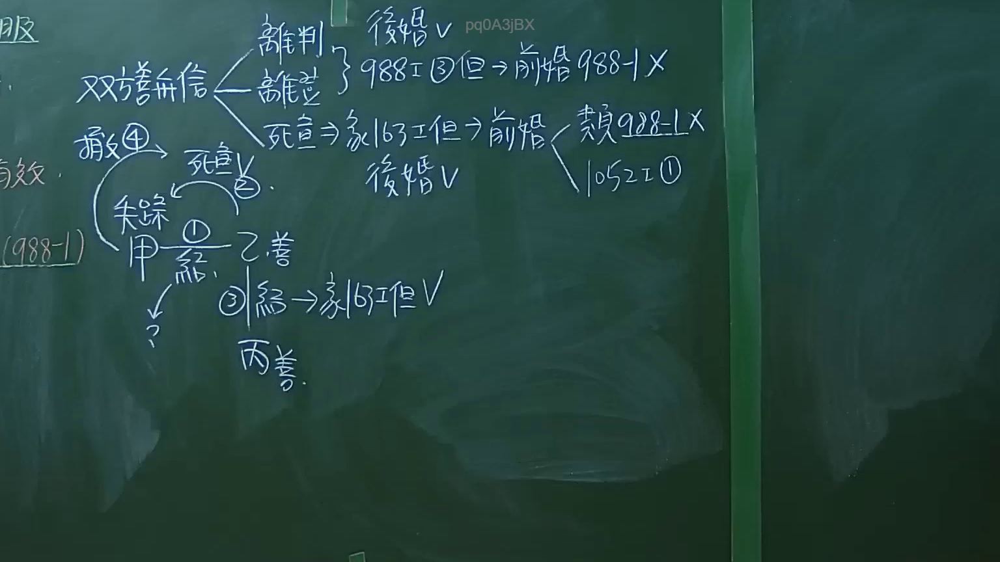

# 🎥 影音教材板書校對筆記
- **來源影片**: [預約 1 2024-09-20 16-13-31-309](file:///J:/身分法/ch1/預約 1 2024-09-20 16-13-31-309.mp4)
- **課程分類**: `[身分法`
- **課堂章節**: `ch1]`
- **影片時間戳記**: `02:16:15` (8175 秒)
- **板書類型**: `影音板書`
- **偵測時間**: 2026-07-19 17:17:53

## 🔍 擷取黑板板書對照圖


## 🧠 AI 智慧理解與知識庫演化註記
：
本板書核心在探討「重婚」在特定情境下的效力，特別是針對「善意」當事人的保護，以及民法修正後關於婚姻無效與撤銷的法律適用。

1. **文字內容辨識**：
   - 包含：雙方善意、離判（裁判離婚）、離登（離婚登記）、死宣（死亡宣告）、後婚、前婚、988條第3項但書、988-1條、163條但書、1052條第2項、失蹤、甲、乙善、丙善。
   - 法律邏輯：討論婚姻在特定條件下（如死亡宣告被撤銷、判決離婚後）的效力存續。

2. **法律學理對照**：
   - **民法第988條第3款但書**：原則上重婚無效，但若符合但書規定（如前婚已解消或撤銷），則不在此限。
   - **民法第988-1條**：此為現行法處理「善意重婚」的保護條款。當事人若均為善意且無過失，重婚得視為有效或有條件保護。
   - **民法第163條但書**：涉及死亡宣告被撤銷時，對於因善意而為之行為（如再婚）的效力認定。
   - **民法第1052條第2項**：判決離婚之概括事由（重大事由難以維持婚姻）。
   - **邏輯演化**：板書分析了「善意」作為阻卻重婚無效的關鍵因素。當發生「死亡宣告被撤銷」或「離婚判決/登記」的情境，若後婚當事人善意，法律傾向保護後婚的效力（類推適用988-1條或依1052條處理）。

## 📊 可編輯之 Mermaid 關係流程圖
```mermaid
：
graph TD
    A["雙方善意"] --> B["離判"]
    A --> C["離登"]
    A --> D["死宣"]
    D --> E["依民法163條但書處理"]
    E --> F["前婚效力受影響"]
    E --> G["後婚視為有效"]
    G --> H["類推適用988-1條"]
    G --> I["參考1052條第2項"]
    J["甲失蹤"] --> K["乙善意"]
    K --> L["再婚(後婚)"]
    L --> M["依民法163條但書有效"]
    M --> N["丙(第三人)善意"]
```

## ✍️ 操作者手動校對修改區
<!-- 您可以直接修改上方的文字或調整 Mermaid 區塊中的節點，Obsidian 會即時重新渲染 -->
- [ ] 欄位結構與法律邏輯已校對無誤。
- **校對筆記**: 
