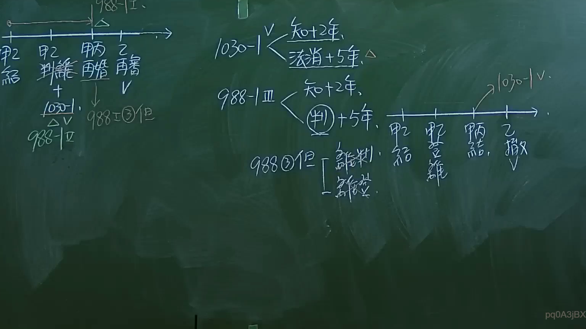

# 🎥 影音教材板書校對筆記
- **來源影片**: [預約 1 2024-09-20 16-13-31-309](file:///J:/身分法/ch1/預約 1 2024-09-20 16-13-31-309.mp4)
- **課程分類**: `[身分法`
- **課堂章節**: `ch1]`
- **影片時間戳記**: `02:22:30` (8550 秒)
- **板書類型**: `影音板書`
- **偵測時間**: 2026-07-19 17:18:03

## 🔍 擷取黑板板書對照圖


## 🧠 AI 智慧理解與知識庫演化註記
：
此板書解析臺灣民法親屬編中有關「婚姻無效」與「撤銷」之請求權消滅時效，重點在於第 988 條之 1、第 1030 條之 1 與第 988 條第 3 款但書的時效期間區分。

1. **辨識文字說明**：
   - 左側軸線：甲結、甲離、丙再婚、乙詹（應為「譫」或筆誤，指撤銷/撤回）、988條第3項但書、1030條第1項、988條之1。
   - 中間核心法條與時效：
     - 1030-1條：知悉撤銷原因起2年，或法定消滅原因起5年。
     - 988-1條第3項：知悉起2年，或判決確定後5年。
     - 988條第3項但書：涉及離婚判決、離婚登記。

2. **法條對照與學理**：
   - **民法第 988-1 條**：針對重婚之處理。板書列出請求撤銷之時效，採取「主觀知悉（2年）」與「客觀事實（5年）」雙軌制。
   - **民法第 1030-1 條**：涉及剩餘財產差額分配請求權。在婚姻關係消滅（含離婚或婚姻無效/撤銷）時，若有爭議，請求權時效同樣適用知悉（2年）與消滅原因（5年）之規定。
   - **民法第 988 條第 3 款但書**：涉及離婚效力之認定，若違反相關形式要件導致重婚，後續可能引發無效或撤銷之法律爭議。
   - **法律邏輯**：本質上是在處理婚姻關係「身分行為」失效後，財產權請求權（如剩餘財產分配）或撤銷權行使的時間限制。

## 📊 可編輯之 Mermaid 關係流程圖
```mermaid
：
graph TD
    A["起始點：結婚"] --> B["婚姻關係中"]
    B --> C["法定時效計算起點"]
    C --> D1["1030-1條：知悉撤銷原因+2年"]
    C --> D2["1030-1條：法定消滅原因+5年"]
    C --> E1["988-1條第三項：知悉+2年"]
    C --> E2["988-1條第三項：判決確定+5年"]
    F["988條第三款但書"] --> G["涉及離婚判決"]
    G --> H["離婚登記"]
    H --> I["撤銷重婚效力"]
```

## ✍️ 操作者手動校對修改區
<!-- 您可以直接修改上方的文字或調整 Mermaid 區塊中的節點，Obsidian 會即時重新渲染 -->
- [ ] 欄位結構與法律邏輯已校對無誤。
- **校對筆記**: 
