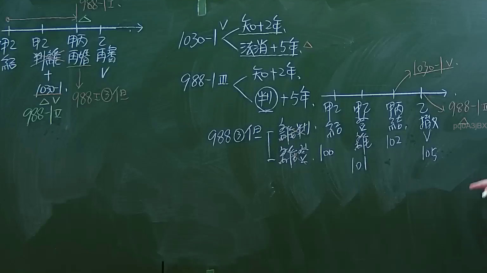

# 🎥 影音教材板書校對筆記
- **來源影片**: [預約 1 2024-09-20 16-13-31-309](file:///J:/身分法/ch1/預約 1 2024-09-20 16-13-31-309.mp4)
- **課程分類**: `[身分法`
- **課堂章節**: `ch1]`
- **影片時間戳記**: `02:23:45` (8625 秒)
- **板書類型**: `影音板書`
- **偵測時間**: 2026-07-19 17:18:08

## 🔍 擷取黑板板書對照圖


## 🧠 AI 智慧理解與知識庫演化註記
：

**板書文字辨識：**
1. 左側時序圖：甲結婚 -> 甲離婚 -> 甲丙再婚 -> 乙再婚。對應法律註記：1030-1、988-I、988-III。
2. 中間條文時效規範：
   - 1030-1 V：知悉+2年、法定財產制消滅+5年。
   - 988-III：知悉+2年、判決+5年。
   - 988-III但書：判決（離婚）。
3. 右側案例時間軸：甲結婚(100) -> 離婚(101) -> 再婚(102) -> 乙撤銷(105)，指向1030-1 V與988-III。

**法律解讀：**
本板書主要講授「剩餘財產分配請求權（民法第1030-1條）」與「婚姻無效/撤銷後之財產請求權（民法第988-1條）」之除斥期間與時效起算點。
- **民法第1030-1條第5項**：規範剩餘財產分配請求權之時效，自請求權人知悉有剩餘財產之差額時起，2年間不行使而消滅；自法定財產制關係消滅時起，逾5年者亦同。
- **民法第988-1條**：針對前婚經撤銷或離婚後之再婚效力。第3項處理再婚後，前婚撤銷對財產制的影響。
- **法律聯想**：此處強調的是「除斥期間」的經過。老師透過時間軸圖解，釐清「知悉」與「客觀事件發生（如離婚判決、法定財產制消滅）」在請求權消滅時效上的區別，這是實務上計算財產分配請求權最核心的爭點。

## 📊 可編輯之 Mermaid 關係流程圖
```mermaid
：
graph TD
    A["時間軸起點"] --> B["甲結婚 100"]
    B --> C["甲離婚 101"]
    C --> D["甲丙再婚 102"]
    D --> E["乙撤銷 105"]
    
    subgraph "法律時效規定"
    F["1030-1 V"] --> G["知悉+2年"]
    F --> H["法定財產制消滅+5年"]
    I["988-III"] --> J["知悉+2年"]
    I --> K["判決+5年"]
    end
    
    E -.-> F
    E -.-> I
```

## ✍️ 操作者手動校對修改區
<!-- 您可以直接修改上方的文字或調整 Mermaid 區塊中的節點，Obsidian 會即時重新渲染 -->
- [ ] 欄位結構與法律邏輯已校對無誤。
- **校對筆記**: 
