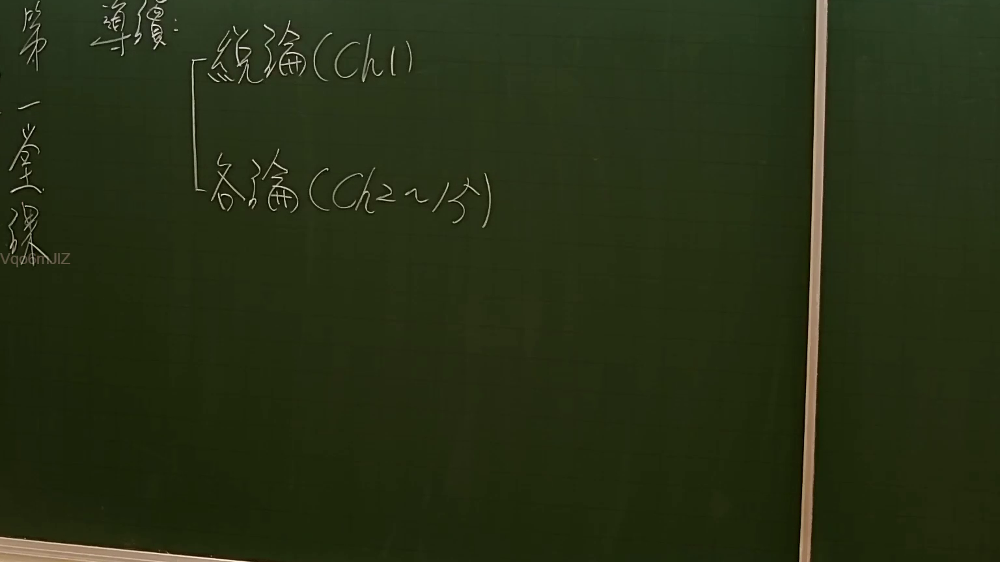

# 🎥 影音教材板書校對筆記
- **來源影片**: [預約 1 2024-11-29 17-26-30-544](file:///J:/土地登記/ch1/預約 1 2024-11-29 17-26-30-544.mp4)
- **課程分類**: `[土地登記`
- **課堂章節**: `ch1]`
- **影片時間戳記**: `00:01:45` (105 秒)
- **板書類型**: `影音板書`
- **偵測時間**: 2026-07-07 16:17:35

## 🔍 擷取黑板板書對照圖


## 🧠 AI 智慧理解與知識庫演化註記
：
此板書呈現了法律或學術課程的典型章節結構與導讀內容。
1.  **「第 章 導讀：」**：這表示課程或教材的第一個主要部分是「導讀」，通常為介紹性質。結合後續的「Ch1」，這很可能指的是「第一章 導讀」，為整門學科揭開序幕。
2.  **「一、重要概念」**：這是導讀章節內的第一個子項目，強調在進入主要內容之前，會先介紹該學科的核心概念與術語，為學習者奠定基礎。
3.  **結構劃分：總論 (Ch1) 與 各論 (Ch2~13)**：這是臺灣法律學術教育中非常普遍且經典的教材編排方式，將一個法學領域的內容區分為「總論」與「各論」兩大部分。
    *   **「總論 (Ch1)」**：意指「總體理論」或「一般原則」。這部分通常涵蓋該學科最基本、最普遍、共通適用的原則、概念、構成要件與法律原則。例如，在民法侵權行為法中，總論會討論侵權行為的一般成立要件（如加害行為、損害、因果關係、歸責事由等）。它在課程中通常會放在最前面，作為基礎知識（此處為第一章）。
    *   **「各論 (Ch2~13)」**：意指「個別理論」或「具體討論」。這部分則會在總論的基礎上，針對該學科的各種具體類型、特殊情形、不同情境下的應用或例外進行深入探討。例如，在民法侵權行為法中，各論會進一步討論特殊侵權行為（如共同侵權、僱用人責任、定作人責任等），或是特定損害類型的處理。這裡標示為第二章至第十三章，顯示其內容的廣泛與深入。

**法條對照與聯想**：
這種總論/各論的結構在臺灣許多法典及學術著作中都有體現，例如：
*   **民法 (Civil Code)**：
    *   **民法總則編 (Book I: General Principles)**（第1條至第152條）：即為整個民法的「總論」，規定了自然人、法人、物、法律行為、期間、消滅時效等共通原則，適用於其他各編。
    *   **民法債編、物權編、親屬編、繼承編**：則可視為民法的「各論」，在總則編的基礎上，分別就債權債務關係、物權的種類與內容、親屬關係以及繼承制度等具體領域進行詳細規定。例如，**民法第184條 (侵權行為)** 雖然屬於債編，但其規定的是侵權行為最一般的成立要件，在某種意義上可視為侵權行為法的「總論」核心條文。而後續關於特殊侵權行為的條文（如第185條、第187條等）則可視為「各論」的具體化。
*   **刑法 (Criminal Code)**：
    *   **刑法總則 (Book I: General Provisions)**（第1條至第99條）：是刑法的「總論」，規定了犯罪的成立要件（如構成要件、違法性、罪責）、未遂犯、共犯、刑罰理論等共通原則。
    *   **刑法分則 (Book II: Specific Provisions)**（第100條至第363條）：是刑法的「各論」，詳細列舉了各種具體犯罪（如殺人罪、竊盜罪、詐欺罪等）及其法律效果。

總體而言，板書內容顯示這門課將循序漸進地引導學生從基本概念、一般原則（總論），逐步深入到各種具體情境與應用（各論），是一種系統性且層次分明的教學安排。

## 📊 可編輯之 Mermaid 關係流程圖
```mermaid
：
graph TD
    A["第 章 導讀："]
    B["一、重要概念"]
    SubjectMatter["本課程內容架構"]

    C["總論 (Ch1)"]
    D["各論 (Ch2~13)"]

    A --> B
    B --> SubjectMatter
    SubjectMatter --> C
    SubjectMatter --> D
```

## ✍️ 操作者手動校對修改區
<!-- 您可以直接修改上方的文字或調整 Mermaid 區塊中的節點，Obsidian 會即時重新渲染 -->
- [ ] 欄位結構與法律邏輯已校對無誤。
- **校對筆記**: 
