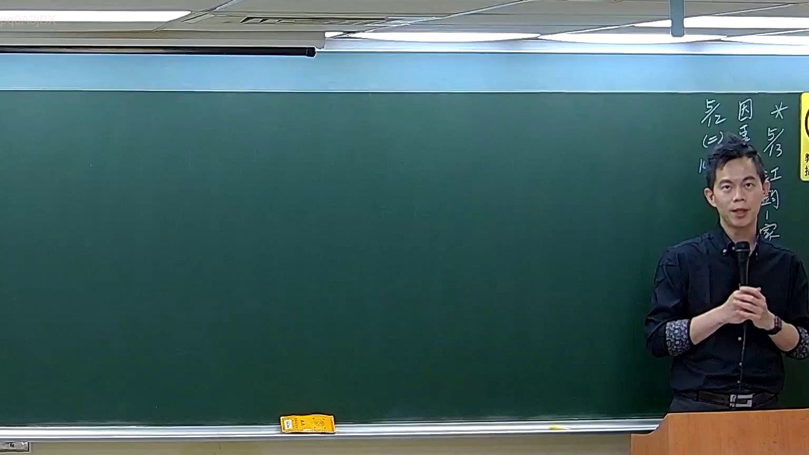
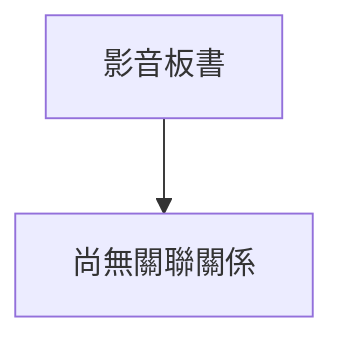

# 🎥 影音教材板書校對筆記
- **來源影片**: [預約 1 2026-04-27 22-55-27-136](file:///H:/家事事件法115/ch1/預約 1 2026-04-27 22-55-27-136.mp4)
- **課程分類**: `[家事事件法115`
- **課堂章節**: `ch1]`
- **影片時間戳記**: `00:02:15` (135 秒)
- **板書類型**: `關係圖/邏輯圖板書`
- **偵測時間**: 2026-07-28 11:29:46

## 🔍 擷取黑板板書對照圖

## 🧠 AI 智慧理解與知識庫演化註記
（無法取得本地大模型之智能註記分析）

## 📊 可編輯之 Mermaid 關係流程圖

## ✍️ 操作者手動校對修改區
<!-- 您可以直接修改上方的文字或調整 Mermaid 區塊中的節點，Obsidian 會即時重新渲染 -->
- [ ] 欄位結構與法律邏輯已校對無誤。
- **校對筆記**: 
