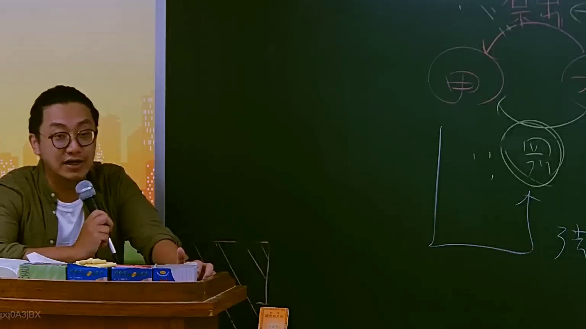

# 🎥 影音教材板書校對筆記
    - **來源影片**: [預約 10 2025-07-24 10-50-37-435](file:///J:/行政法A/ch10/預約 10 2025-07-24 10-50-37-435.mp4)
    - **課程分類**: `[行政法A`
    - **課堂章節**: `ch10]`
    - **影片時間戳記**: `00:42:15` (2535 秒)
    - **板書類型**: `影音板書`
    - **偵測時間**: 2026-07-22 05:10:16
    
    ## 🔍 擷取黑板板書對照圖
    
    
    ## 🧠 AI 智慧理解與知識庫演化註記
    ：
1. 【板書高精度 OCR 辨識】：
   - 頂端左側：圓圈內文字「甲」。
   - 頂端右側：圓圈內文字「乙」。
   - 中間偏下：被雙重圓圈包圍的文字「丙」。
   - 符號與關係：
     - 「甲」與「乙」之間有弧線連接，代表兩者間存在法律關係（通常為債之關係）。
     - 從「乙」的方向有隱形的法律效力指向「丙」。
     - 「丙」的左側有一個垂直的 L 型邊框，代表特定的財產範圍或法律歸屬空間。
     - 右下角有手寫字「強」（推測為「強制執行」之簡寫）。
     - 「丙」的下方有一個向上的箭頭，代表權利行使或追索的方向。

2. 【法律學理與爭點解讀】：
   - **核心主題：債之保全（Preservation of Claims）**
     此圖為典型的「三角法律關係圖」，常用於解釋台灣民法中關於債權人如何透過法律手段，介入債務人與第三人間之關係。
   - **民法第 242 條（代位權）**：
     當「債務人甲」怠於行使其對「第三人丙」的權利（例如甲不向丙討債），導致「債權人乙」的債權有受損之虞時，乙得依此條以自己名義行使甲對丙的權利。
   - **民法第 244 條（詐害行為撤銷權）**：
     若「債務人甲」將財產惡意移轉給「第三人丙」（如假買賣、贈與），企圖逃避「債權人乙」的追討，乙得聲請法院撤銷甲與丙之間的法律行為。
   - **強制執行與「強」字之連結**：
     右下角的「強」字對應台灣《強制執行法》，特別是針對「債務人對於第三人之權利」的執行（強執法第 115 條以下）。當乙取得對甲的執行名義後，可以向執行法院聲請扣押甲對丙的債權（發扣押命令、收取命令或移轉命令）。

3. 【法律演化註記】：
   - 在現代債法中，丙（第三人）的地位受到程序保障。若為代位權行使，丙得主張其對甲的所有抗辯；若為撤銷權，則涉及交易安全與善意受讓的權衡。
    
    ## 📊 可編輯之 Mermaid 關係流程圖
    ```mermaid
    ：
graph TD
    A["債務人 甲"] --- B["債權人 乙"]
    A -- "法律行為/權利" --> C["第三人 丙"]
    B -.->|"1.代位權 (民242)"| C
    B -.->|"2.撤銷權 (民244)"| C
    D["強制執行 (強)"] --> C
    style C stroke-width4px,stroke#333
    subgraph "財產保全範圍"
    C
    end
    ```
    
    ## ✍️ 操作者手動校對修改區
    <!-- 您可以直接修改上方的文字或調整 Mermaid 區塊中的節點，Obsidian 會即時重新渲染 -->
    - [ ] 欄位結構與法律邏輯已校對無誤。
    - **校對筆記**: 
    