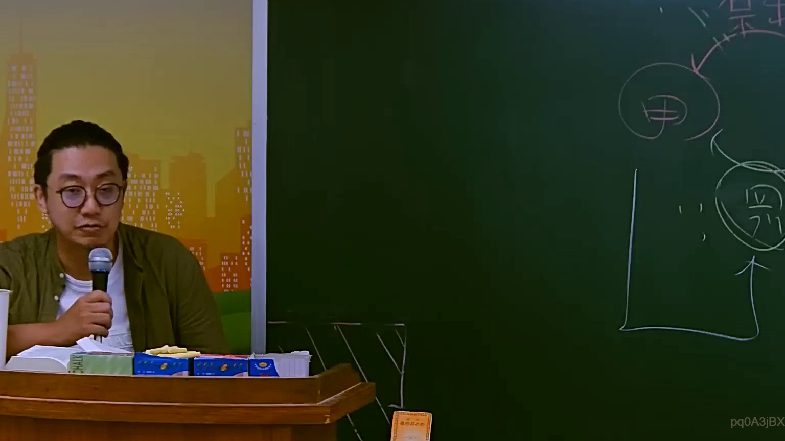

# 🎥 影音教材板書校對筆記
    - **來源影片**: [預約 10 2025-07-24 10-50-37-435](file:///J:/行政法A/ch10/預約 10 2025-07-24 10-50-37-435.mp4)
    - **課程分類**: `[行政法A`
    - **課堂章節**: `ch10]`
    - **影片時間戳記**: `00:54:30` (3270 秒)
    - **板書類型**: `影音板書`
    - **偵測時間**: 2026-07-22 05:10:36
    
    ## 🔍 擷取黑板板書對照圖
    
    
    ## 🧠 AI 智慧理解與知識庫演化註記
    ：
1. 板書內容高精度 OCR 辨識：
   - 頂端文字：保（代表「保證人」或「保證契約」）。
   - 中間圈選文字：甲（通常代表「債權人」）。
   - 下方圈選文字：乙（通常代表「主債務人」）。
   - 符號與關係線：
     - 「乙」指向「甲」的向上箭頭，代表主職務之履行關係。
     - 「甲」與「保」之間的雙向或連結線，代表保證契約之成立（保證契約存在於債權人與保證人之間）。
     - 左側與下方的 L 型線條與標註，用以界定法律責任的範圍或訴訟上的當事人地位。

2. 法律學理與爭點解讀：
   - 本板書呈現的是臺灣民法中極為重要的「保證關係（Guaranty）」三角架構。
   - 【主契約關係】：存在於「甲（債權人）」與「乙（主債務人）」之間。依據民法第 199 條，債權人有權請求債務人給付。
   - 【保證契約關係】：存在於「甲（債權人）」與「保（保證人）」之間。請注意，保證契約並非存在於債務人與保證人之間，而是債權人與保證人之間的契約（民法第 739 條）。
   - 【法律特性 - 從屬性】：板書中將「保」置於上方並與「甲」連結，強調了保證債務的從屬性（民法第 741 條）。若乙的主債務不存在，則保證人的義務亦不成立。
   - 【爭點聯想 - 檢索抗辯權】：老師可能正在講解民法第 745 條。保證人於債權人未就主債務人乙的財產強制執行而無效果前，對於債權人甲得拒絕清償（先訴抗辯權/檢索抗辯權）。

3. 臺灣現行法條對位：
   - 民法第 739 條：稱保證者，謂當事人約定，一方於他方之債務人不履行債務時，由其代負履行責任之契約。
   - 民法第 740 條：保證債務之範圍（包含主債務之利息、違約金、損害賠償等）。
   - 民法第 272 條：若涉及「連帶保證」，則保證人將拋棄民法第 745 條之權利，此為實務上最常見的爭點。
    
    ## 📊 可編輯之 Mermaid 關係流程圖
    ```mermaid
    ：
graph TD
    A["債權人 甲"] -- "主契約 (請求給付)" --- B["主債務人 乙"]
    A["債權人 甲"] -- "保證契約 (第739條)" --- C["保證人 (保)"]
    B -- "委任或無因管理" --> C
    C -. "從屬性與補充性" .-> B
    subgraph "責任範圍"
    B
    end
    style C fill#f9f,stroke#333,stroke-width2px
    style A fill#fff,stroke#333,stroke-width2px
    style B fill#fff,stroke#333,stroke-width2px
    ```
    
    ## ✍️ 操作者手動校對修改區
    <!-- 您可以直接修改上方的文字或調整 Mermaid 區塊中的節點，Obsidian 會即時重新渲染 -->
    - [ ] 欄位結構與法律邏輯已校對無誤。
    - **校對筆記**: 
    