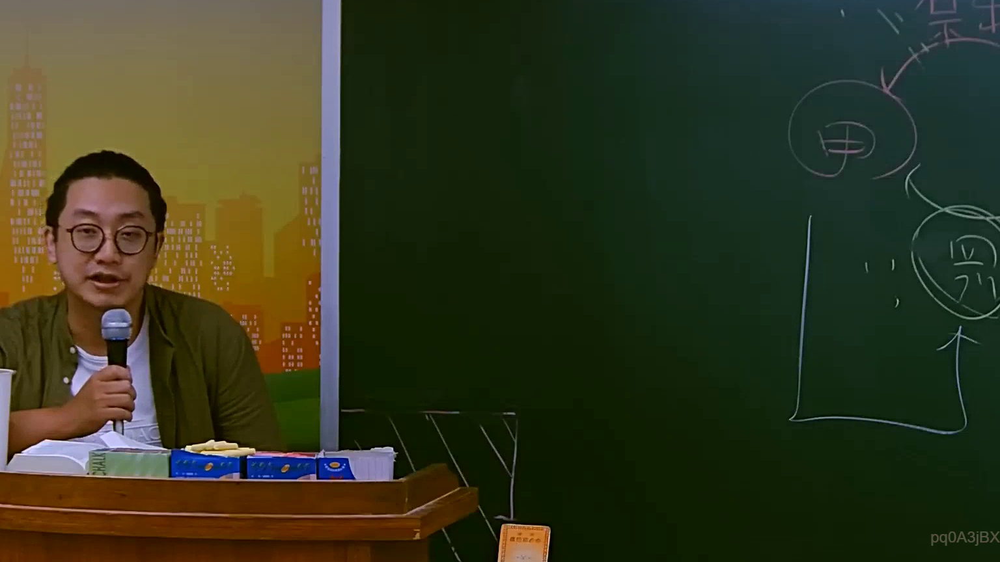

# 🎥 影音教材板書校對筆記
    - **來源影片**: [預約 10 2025-07-24 10-50-37-435](file:///J:/行政法A/ch10/預約 10 2025-07-24 10-50-37-435.mp4)
    - **課程分類**: `[行政法A`
    - **課堂章節**: `ch10]`
    - **影片時間戳記**: `00:55:15` (3315 秒)
    - **板書類型**: `影音板書`
    - **偵測時間**: 2026-07-22 05:10:46
    
    ## 🔍 擷取黑板板書對照圖
    
    
    ## 🧠 AI 智慧理解與知識庫演化註記
    ：
1. 【板書高精度 OCR】：
圖片右側黑板上可辨識的文字與符號包含：
- 主體「甲」與「丙」
- 互相對應的雙向箭頭關係
- 下方框線與對應箭頭指示

2. 【板書詳細解讀與法條對照】：
- 法律學理與案例邏輯：本板書呈現典型的多方主體法律關係（如甲與丙之間之互動、契約關係或身分法上之請求權基礎）。在民法財產法或身分法的案例教學中，常以圓圈代表主體（如甲、丙），並透過箭頭表示意思表示之發出、給付義務、請求權行使或侵權行為之因果關係。
- 臺灣現行法律條文對照：
  - 若涉及契約關係，對應民法第153條（契據之成立）。
  - 若涉及債不履行或損害賠償，常對應民法第226條（給付不能）或第184條（侵權行為）。
  - 透過視覺化圖解，能幫助釐清複雜法律事實中各當事人間的權利義務歸屬。
    
    ## 📊 可編輯之 Mermaid 關係流程圖
    ```mermaid
    ：
graph TD
    A["甲"] <--> B["丙"]
    B --> C["相關法律效果與請求權"]
    ```
    
    ## ✍️ 操作者手動校對修改區
    <!-- 您可以直接修改上方的文字或調整 Mermaid 區塊中的節點，Obsidian 會即時重新渲染 -->
    - [ ] 欄位結構與法律邏輯已校對無誤。
    - **校對筆記**: 
    