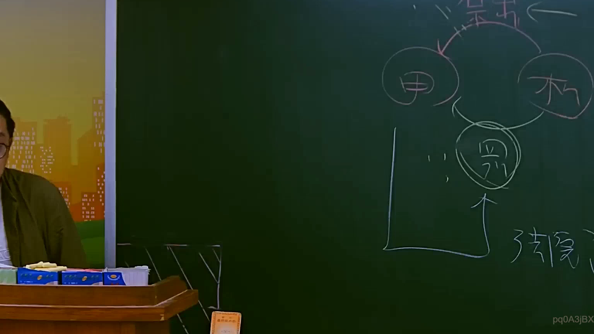

# 🎥 影音教材板書校對筆記
    - **來源影片**: [預約 10 2025-07-24 10-50-37-435](file:///J:/行政法A/ch10/預約 10 2025-07-24 10-50-37-435.mp4)
    - **課程分類**: `[行政法A`
    - **課堂章節**: `ch10]`
    - **影片時間戳記**: `00:56:15` (3375 秒)
    - **板書類型**: `影音板書`
    - **偵測時間**: 2026-07-22 05:10:50
    
    ## 🔍 擷取黑板板書對照圖
    
    
    ## 🧠 AI 智慧理解與知識庫演化註記
    ：
1. 板書文字與結構辨識：
   - 圖片右上方繪製了三個圓圈，分別代表多方主體「甲」、「乙」（或稱丙）以及下方的「丙」（或丁），形成一個相互關聯的多角法律關係或請求權迴圈圖。
   - 圓圈「甲」與其他主體之間有雙向箭頭與刪除/修正記號；下方則有一個獨立的方框與箭頭指向圓圈「丙」，旁邊標註有「侵權」相關字樣。

2. 法律學理與爭點對照：
   - 此類板書通常應用於民法債編中之「多角化法律關係」、「第三人利益契約」、「代位權（民法第242條）」、「不當得利（民法第179條）」或「侵權行為（民法第184條）」等複雜財產法爭點解析。
   - 當多數主體間存有契約鏈或因不法行為產生競合時，常以圓圈圖解法理上的請求權基礎流向與責任歸屬。
    
    ## 📊 可編輯之 Mermaid 關係流程圖
    ```mermaid
    ：
graph TD
    A["甲"] <--> B["乙"]
    B --> C["丙"]
    C --> A
    D["侵權行為 / 請求權"] --> C
    ```
    
    ## ✍️ 操作者手動校對修改區
    <!-- 您可以直接修改上方的文字或調整 Mermaid 區塊中的節點，Obsidian 會即時重新渲染 -->
    - [ ] 欄位結構與法律邏輯已校對無誤。
    - **校對筆記**: 
    