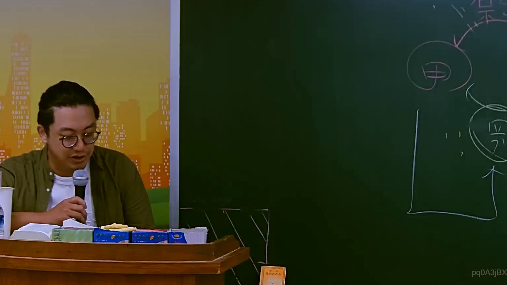

# 🎥 影音教材板書校對筆記
    - **來源影片**: [預約 10 2025-07-24 10-50-37-435](file:///J:/行政法A/ch10/預約 10 2025-07-24 10-50-37-435.mp4)
    - **課程分類**: `[行政法A`
    - **課堂章節**: `ch10]`
    - **影片時間戳記**: `01:02:30` (3750 秒)
    - **板書類型**: `影音板書`
    - **偵測時間**: 2026-07-22 05:11:00
    
    ## 🔍 擷取黑板板書對照圖
    
    
    ## 🧠 AI 智慧理解與知識庫演化註記
    ：
1. 【板書高精度 OCR】：
根據圖片右側黑板上的板書內容，辨識出以下文字與符號：
- 主體圓圈：「甲」、「丙」（或視情況對應的法律主體）
- 箭頭與連線：呈現雙向或單向的法律關係互動（如債權債務關係、代理或侵權互動）。

2. 【板書詳細解讀與法條對照】：
- 解說：此圖通常用於民法財產法（如債編各論、契約法或物權法）的多方主體法律關係解析。透過圖形化主體（如甲、丙）之間的互動，釐清請求權基礎、契約相對性原則（民法第199條以下）或代理權授與（民法第103條）。
- 法條對照：
  - 民法第 199 條（債之發生）：債權人基於債之關係，得向債務人請求給付。
  - 民法第 103 條（代理行為之效力）：代理人於代理權限內，以本人名義所為之意思表示，直接對本人發生效力。
    
    ## 📊 可編輯之 Mermaid 關係流程圖
    ```mermaid
    ：
graph TD
    A["甲"] --> B["丙"]
    B --> A
    ```
    
    ## ✍️ 操作者手動校對修改區
    <!-- 您可以直接修改上方的文字或調整 Mermaid 區塊中的節點，Obsidian 會即時重新渲染 -->
    - [ ] 欄位結構與法律邏輯已校對無誤。
    - **校對筆記**: 
    