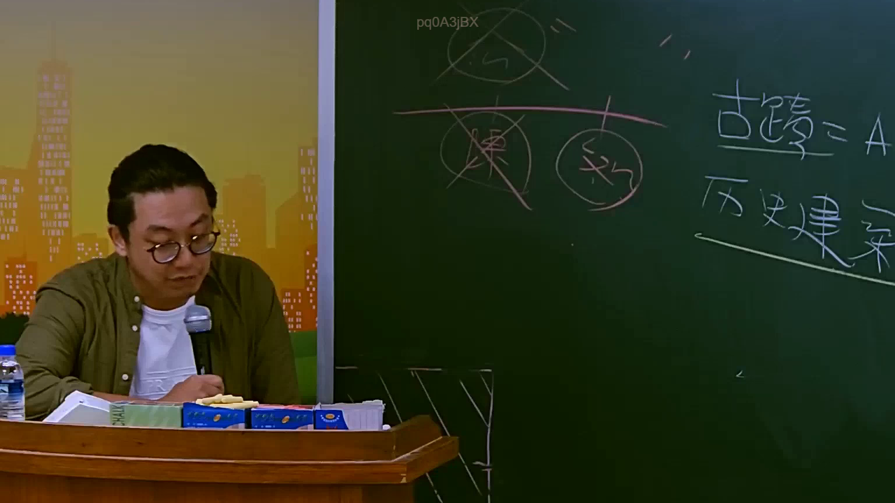

# 🎥 影音教材板書校對筆記
    - **來源影片**: [預約 10 2025-07-24 10-50-37-435](file:///J:/行政法A/ch10/預約 10 2025-07-24 10-50-37-435.mp4)
    - **課程分類**: `[行政法A`
    - **課堂章節**: `ch10]`
    - **影片時間戳記**: `02:11:45` (7905 秒)
    - **板書類型**: `影音板書`
    - **偵測時間**: 2026-07-22 05:11:29
    
    ## 🔍 擷取黑板板書對照圖
    
    
    ## 🧠 AI 智慧理解與知識庫演化註記
    ：
1. 板書文字辨識：
   - 畫面右側寫有：「古蹟 = A」、「歷史建築」。
   - 畫面中央上方有被刪除的圖示（帶有打叉的圓圈，如「陳」、「效」等字樣，並有一橫線橫跨其上）。
2. 法律學理與爭點解析：
   - 本板書涉及臺灣《文化資產保存法》（簡稱文資法）中對於「古蹟」與「歷史建築」之法律定義、分類及其法律效果的區辨。
   - 在我國行政法學與文化資產法理中，古蹟（依文資法第3條規定，分為國定、直轄市定、縣市定古蹟）與歷史建築屬於不同等級與審查機關的文化資產。古蹟的指定程序與法律限制（如容積轉移、土地使用限制、補助與罰則）通常較歷史建築更為嚴格（標示為 A 等級代表較高位階或特定分類）。
   - 老師透過板書推演文資法上的法定概念（古蹟與歷史建築的差異及排除錯誤概念），並對照行政處分或法條適用上的爭點。
    
    ## 📊 可編輯之 Mermaid 關係流程圖
    ```mermaid
    ：
graph TD
    A["文化資產"] --> B["古蹟 = A"]
    A --> C["歷史建築"]
    B --> D["較嚴格之法定限制與審查"]
    C --> E["相對彈性之保存與管理"]
    ```
    
    ## ✍️ 操作者手動校對修改區
    <!-- 您可以直接修改上方的文字或調整 Mermaid 區塊中的節點，Obsidian 會即時重新渲染 -->
    - [ ] 欄位結構與法律邏輯已校對無誤。
    - **校對筆記**: 
    