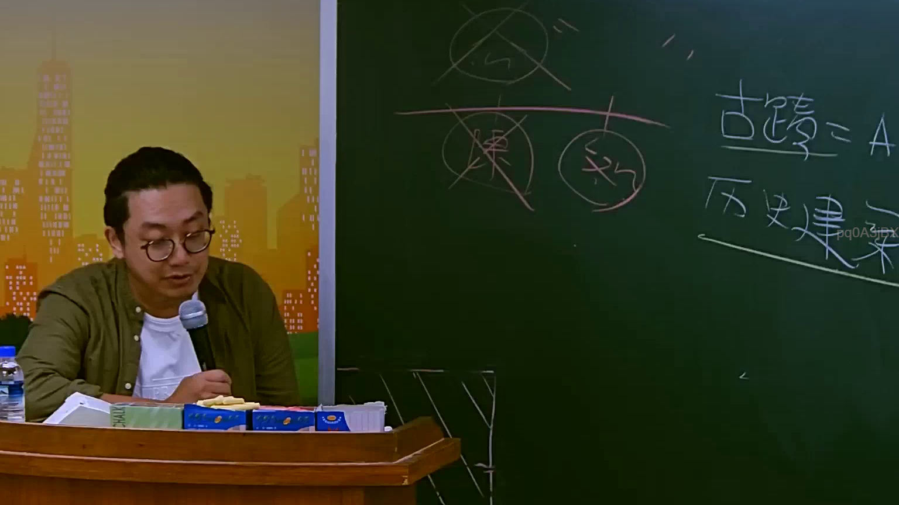

# 🎥 影音教材板書校對筆記
    - **來源影片**: [預約 10 2025-07-24 10-50-37-435](file:///J:/行政法A/ch10/預約 10 2025-07-24 10-50-37-435.mp4)
    - **課程分類**: `[行政法A`
    - **課堂章節**: `ch10]`
    - **影片時間戳記**: `02:12:30` (7950 秒)
    - **板書類型**: `影音板書`
    - **偵測時間**: 2026-07-22 05:11:37
    
    ## 🔍 擷取黑板板書對照圖
    
    
    ## 🧠 AI 智慧理解與知識庫演化註記
    ：
1. 【板書高精度 OCR】：
   圖片中右側主要文字為「古蹟=A」以及「歷史建築」，上方有層級關係圖（包含被刪除的項目與保留的項目）。
2. 【板書詳細解讀與法條對照】：
   - 本板書涉及臺灣《文化資產保存法》（簡稱文資法）中對於「古蹟」與「歷史建築」的法律概念、分類及法定地位之推導。
   - 在我國文化資產保存法體系下，文化資產分為有形文化資產與無形文化資產，其中有形文化資產包含古蹟、歷史建築、紀念建築、聚落建築群、史蹟、文化景觀、古物、自然景觀、自然紀念物。
   - 板書中將「古蹟」設定為 A 類（代表最高層級或特定法律效果之標的），並與「歷史建築」進行區辨。這通常是在探討文資法第 14 條至第 18 條關於古蹟指定程序、暫定古蹟，以及與歷史建築（同法第 60 條授權訂定之相關辦法）在法律效果、獎勵、補助與限制（如容積移轉、修復再利用限制）上的差異。
    
    ## 📊 可編輯之 Mermaid 關係流程圖
    ```mermaid
    ：
graph TD
    A["文化資產"] --> B["古蹟 = A"]
    A --> C["歷史建築"]
    B --> D["法定嚴格限制與高度保護"]
    C --> E["相對彈性之保存與管理"]
    ```
    
    ## ✍️ 操作者手動校對修改區
    <!-- 您可以直接修改上方的文字或調整 Mermaid 區塊中的節點，Obsidian 會即時重新渲染 -->
    - [ ] 欄位結構與法律邏輯已校對無誤。
    - **校對筆記**: 
    