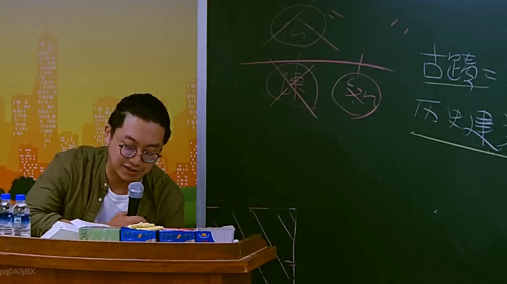

# 🎥 影音教材板書校對筆記
    - **來源影片**: [預約 10 2025-07-24 10-50-37-435](file:///J:/行政法A/ch10/預約 10 2025-07-24 10-50-37-435.mp4)
    - **課程分類**: `[行政法A`
    - **課堂章節**: `ch10]`
    - **影片時間戳記**: `02:18:30` (8310 秒)
    - **板書類型**: `影音板書`
    - **偵測時間**: 2026-07-22 05:11:46
    
    ## 🔍 擷取黑板板書對照圖
    
    
    ## 🧠 AI 智慧理解與知識庫演化註記
    ：
本板書畫面主要探討臺灣文化資產保存法相關概念與學理爭點。
1. 板書文字辨識：
   - 右側寫有：「古蹟 = 歷史建築」並帶有刪除線與修正，探討古蹟與歷史建築之法律概念與法定要件之異同。
   - 上方與中間繪有帶有刪除線、圓圈及橫線的分類架構圖，象徵行政法學上對於公物、文化資產、特別權力關係或主管機關處分（如指定古蹟或登錄歷史建築）的法律性質與體系區辨。
2. 法律與學理對照：
   - 涉及《文化資產保存法》第3條、第18條、第41條等規定，關於古蹟與歷史建築之指定、登錄程序、公法上之限制（如容積移轉、財產權限制等）。
   - 行政法理上，此處強調行政主體對於文化資產指定處分的裁量權、法定程序瑕疵，以及是否構成特別犧牲而應予補償的爭點。
    
    ## 📊 可編輯之 Mermaid 關係流程圖
    ```mermaid
    ：
graph TD
    A["文化資產概念"] --> B["古蹟"]
    A --> C["歷史建築"]
    B -.->|"法定要件區辨"| C
    D["主管機關處分"] --> E["指定古蹟"]
    D --> F["登錄歷史建築"]
    E --> G["財產權限制與公法義務"]
    ```
    
    ## ✍️ 操作者手動校對修改區
    <!-- 您可以直接修改上方的文字或調整 Mermaid 區塊中的節點，Obsidian 會即時重新渲染 -->
    - [ ] 欄位結構與法律邏輯已校對無誤。
    - **校對筆記**: 
    