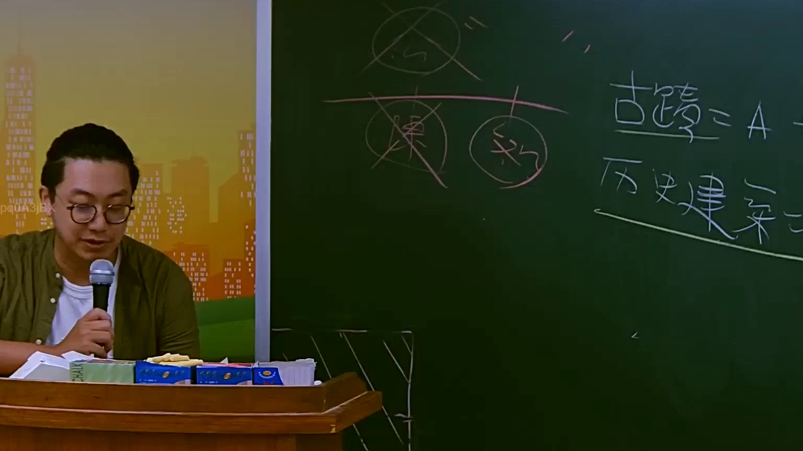

# 🎥 影音教材板書校對筆記
    - **來源影片**: [預約 10 2025-07-24 10-50-37-435](file:///J:/行政法A/ch10/預約 10 2025-07-24 10-50-37-435.mp4)
    - **課程分類**: `[行政法A`
    - **課堂章節**: `ch10]`
    - **影片時間戳記**: `02:24:45` (8685 秒)
    - **板書類型**: `影音板書`
    - **偵測時間**: 2026-07-22 05:11:56
    
    ## 🔍 擷取黑板板書對照圖
    
    
    ## 🧠 AI 智慧理解與知識庫演化註記
    ：
1. 板書文字辨識 (OCR)：
   - 畫面右側文字：
     - 「古蹟 = A」
     - 「歷史建築 = B」
   - 畫面左上方圖示與文字：
     - 繪有圓圈與刪除線，下方橫線並列兩個被圈選的項目，左側疑似為「陳」，右側疑似為「文」或其他代稱，並有打叉刪除符號，象徵排除或不適用特定法定身分或程序。

2. 法律學理與法條對照：
   - 本板書涉及臺灣《文化資產保存法》（簡稱文資法）中對於「古蹟」與「歷史建築」的法律概念與法定定義區辨。
   - 依據臺灣現行《文化資產保存法》第3條規定，古蹟與歷史建築屬於不同級別與法定程序的有形文化資產。
   - 古蹟（對應板書之 A）與歷史建築（對應板書之 B）在指定程序、審查基準、法律效力（如容積移轉、補助、罰則及管理維護義務）上有所不同。板書透過等號與分類，釐清兩者在法理上的界線與歸類，並透過刪除符號排除錯誤的法律適用或混淆概念。
    
    ## 📊 可編輯之 Mermaid 關係流程圖
    ```mermaid
    ：
graph TD
    A["文化資產分類"] --> B["古蹟 = A"]
    A --> C["歷史建築 = B"]
    B --> D["文資法相關規範與法定程序"]
    C --> D
    ```
    
    ## ✍️ 操作者手動校對修改區
    <!-- 您可以直接修改上方的文字或調整 Mermaid 區塊中的節點，Obsidian 會即時重新渲染 -->
    - [ ] 欄位結構與法律邏輯已校對無誤。
    - **校對筆記**: 
    