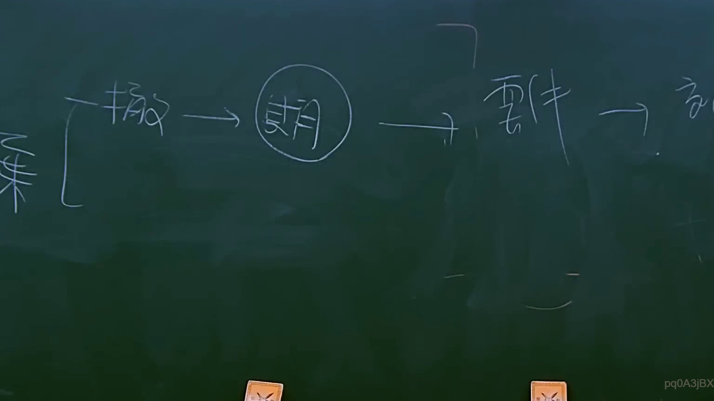

# 🎥 影音教材板書校對筆記
    - **來源影片**: [預約 11 2025-07-24 13-18-51-359](file:///J:/行政法A/ch11/預約 11 2025-07-24 13-18-51-359.mp4)
    - **課程分類**: `[行政法A`
    - **課堂章節**: `ch11]`
    - **影片時間戳記**: `00:13:15` (795 秒)
    - **板書類型**: `影音板書`
    - **偵測時間**: 2026-07-22 05:31:32
    
    ## 🔍 擷取黑板板書對照圖
    
    
    ## 🧠 AI 智慧理解與知識庫演化註記
    ：

一、 板書高精度 OCR 識別
1. 最左側大括號（ { ）整合了兩個概念，上方為「撤」（代表撤銷、撤回），下方對應「棄」（代表拋棄）。這兩者在民法總則中皆屬於典型的「單獨行為」（或稱單方行為），且多與「形成權」的行使相關。
2. 「撤」指向一個圈起來的「期」字，代表「期間」（特別是形成權所適用之「除斥期間」，或消滅時效）。
3. 圈起來的「期」指向「要件」，代表行使撤銷、撤回或拋棄等權利時，必須符合法定的構成要件。
4. 「要件」指向最右側的「效」字（因板書書寫至邊緣，此處為「效果」或「效力」之簡寫），代表滿足要件並於期間內行使後，所產生的法律效果。

二、 法律詳細解讀與臺灣民法條文對照
本板書呈現了民法總則中關於「意思表示之撤回」、「法律行為之撤銷」以及「權利之拋棄」在時間限制（期間）、法定要件與法律效果之間的邏輯關係。

1. 「撤」（撤回與撤銷）的學理與法條對照：
   - 意思表示的「撤回」：指阻止尚未發生效力的意思表示發生效力。例如《民法》第95條第1項但書規定，撤回之通知，同時或先於該意思表示達到者，效力不發生。
   - 法律行為的「撤銷」：指使已發生效力的法律行為，因意思表示不自由（如詐欺、脅迫）或錯誤，而使其溯及歸於無效。例如《民法》第88條（錯誤撤銷）、第92條（因被詐欺或被脅迫而為意思表示之撤銷）。
2. 「期」（期間/除斥期間）的學理與法條對照：
   - 撤銷權屬於「形成權」，其行使期間在法律上稱為「除斥期間」（與債權適用的消滅時效不同，除斥期間不得中斷或不完成，期間屆滿後權利當然消滅）。
   - 例如《民法》第90條規定，錯誤撤銷權自意思表示後，經過一年而消滅；第93條規定，因被詐欺或被脅迫而為意思表示之撤銷，應自發現詐欺或脅迫終止後，一年內為之。但自意思表示後，經過十年者，亦不得撤銷。
3. 「要件」（行使要件）的學理與法條對照：
   - 行使撤銷權必須符合法定要件。例如依《民法》第88條撤銷錯誤意思表示，要件為「表意人無過失」；依《民法》第92條因詐欺行使撤銷權，若為第三人詐欺，須以「相對人明知或可得而知」為要件。
4. 「效」（法律效果）的學理與法條對照：
   - 撤銷權一旦合法行使，其法律效果依《民法》第114條第1項規定：「法律行為經撤銷者，視為自始無效。」
   - 對於物權行為若一併撤銷，則會產生不當得利請求權（《民法》第179條）之返還問題。
    
    ## 📊 可編輯之 Mermaid 關係流程圖
    ```mermaid
    ：
graph LR
    A["單獨行為 / 形成權"] --> B["撤 (撤銷 / 撤回)"]
    A --> C["棄 (拋棄)"]
    B --> D("(期) 除斥期間 / 限制")
    D --> E["要件 (法定構成要件)"]
    E --> F["效 (自始無效 / 權利消滅)"]

    style D fill#f9f,stroke#333,stroke-width2px
    ```
    
    ## ✍️ 操作者手動校對修改區
    <!-- 您可以直接修改上方的文字或調整 Mermaid 區塊中的節點，Obsidian 會即時重新渲染 -->
    - [ ] 欄位結構與法律邏輯已校對無誤。
    - **校對筆記**: 
    