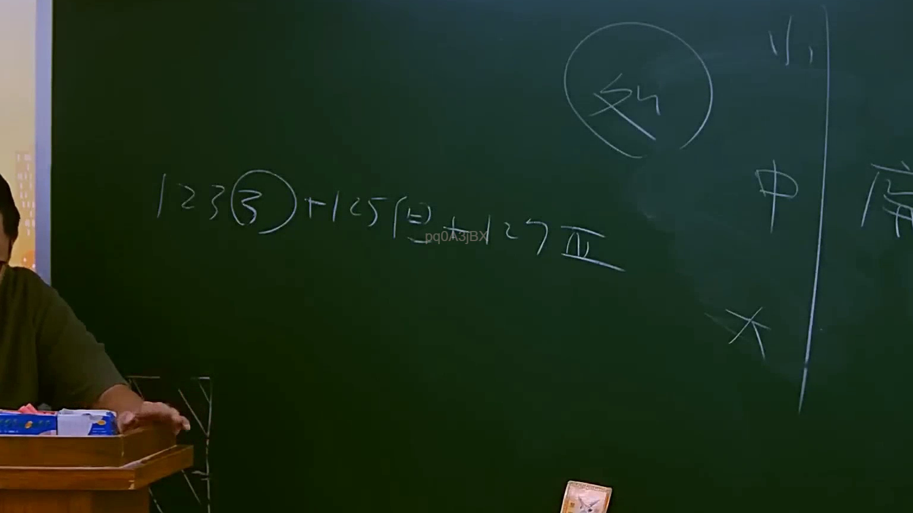

# 🎥 影音教材板書校對筆記
    - **來源影片**: [預約 11 2025-07-24 13-18-51-359](file:///J:/行政法A/ch11/預約 11 2025-07-24 13-18-51-359.mp4)
    - **課程分類**: `[行政法A`
    - **課堂章節**: `ch11]`
    - **影片時間戳記**: `00:56:45` (3405 秒)
    - **板書類型**: `影音板書`
    - **偵測時間**: 2026-07-22 05:35:09
    
    ## 🔍 擷取黑板板書對照圖
    
    
    ## 🧠 AI 智慧理解與知識庫演化註記
    ：
本張板書呈現的是臺灣**行政程序法**中有關「合法授益行政處分之廢止」、「附款（負擔）不履行之法律效果」以及「公法上不當得利返還請求權時效」的經典核心體系。

一、 板書高精度 OCR 辨識結果
1. 左側關係式：`123 ③ + 125 (但) → 127 Ⅳ`
2. 右上方圓圈：`外`
3. 右側結構：
   `小 |`
   `中 | 廢`
   `大 |`
   （註：「廢」為「廢止」之簡寫，左側以直線區隔「小、中、大」三種層次）

二、 詳細法律學理、爭點與法條對照
1. **左側公式解讀（授益處分廢止與公法上不當得利）：**
   * **「123 ③」——行政程序法第123條第3款**：
     本款規定合法之授益行政處分，若「附負擔之行政處分，受益人未履行該負擔者」，行政機關得依職權全部或一部廢止之。
   * **「125 (但)」——行政程序法第125條但書（配合上方圓圈「外」）**：
     行政程序法第125條規定，合法行政處分廢止後，原則上「自廢止時起」向後失效。但其**但書**規定：「受益人未履行負擔致行政處分被廢止者，得收拾其效力，**溯及既往失其效力**。」此即為板書中圓圈「**外**」所指的「例外情形」（溯及失效）。
   * **「127 Ⅳ」——行政程序法第127條第4項（公法上不當得利之返還請求權與時效）**：
     當行政處分依上述規定被溯及既往廢止後，受益人先前領取的給付即失去法律上原因，構成公法上不當得利，行政機關應依同條第1項規定請求返還。而該返還請求權的消滅時效，則適用**第127條第4項**：「前項返還請求權，自公務員知有返還原因時起，因**二年間**不行使而消滅；自處分撤銷、廢止或達其目的之日起，逾**五年者**亦同。」

2. **右側結構解讀（附款對「廢止」之影響強度）：**
   此處呈現的是行政法學上「行政處分附款」（行政程序法第93條）依其對處分效力影響強度（小、中、大）與「廢（廢止）」之關係：
   * **「小」—— 負擔（行政程序法第93條第2項第3款）**：
     對處分效力的影響最「小」。受益人縱使不履行負擔，行政處分亦不會自動失效，仍維持有效，必須由行政機關另行作成「廢止處分」（即依§123③）方能使其失效。
   * **「中」—— 廢止權之保留（行政程序法第93條第2項第4款）**：
     影響程度居「中」。行政機關保留了廢止的權利，當特定事由發生時，行政機關得依§123②廢止該處分，但同樣需要行政機關積極作成廢止處分。
   * **「大」—— 條件／期限（行政程序法第93條第2項第1款、第2款）**：
     對處分效力的影響最「大」（如解除條件成就或終期屆至）。一旦條件成就或期限屆至，行政處分**自動失效**，完全不需要行政機關再行作成任何「廢止（廢）」之處分。
    
    ## 📊 可編輯之 Mermaid 關係流程圖
    ```mermaid
    ：
graph TD
    subgraph "左側：公法上不當得利返還請求權"
        A["行政程序法第123條第3款<br>(受益人未履行負擔)"] --> B["行政程序法第125條但書<br>(溯及既往失效)"]
        C["例外 (外)"] -.-> B
        B --> D["行政程序法第127條第4項<br>(公法上不當得利返還請求權)"]
        D --> E["消滅時效：<br>知悉起 2 年 / 廢止起 5 年"]
    end

    subgraph "右側：附款對『廢止』之影響強度"
        F["附款類型"] --> G["小：負擔"]
        F --> H["中：廢止權保留"]
        F --> I["大：條件 / 期限"]
        
        G --> J["『廢』：需機關發動廢止處分 (§123③)"]
        H --> J
        I --> K["自動失效<br>(無需作成廢止處分)"]
    end
    ```
    
    ## ✍️ 操作者手動校對修改區
    <!-- 您可以直接修改上方的文字或調整 Mermaid 區塊中的節點，Obsidian 會即時重新渲染 -->
    - [ ] 欄位結構與法律邏輯已校對無誤。
    - **校對筆記**: 
    