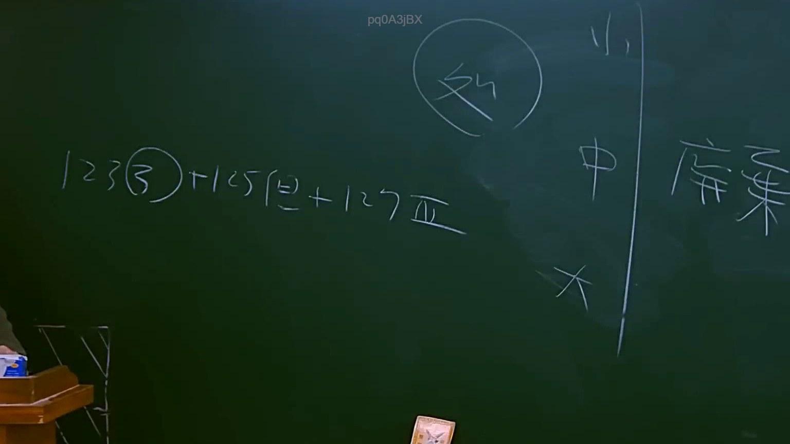

# 🎥 影音教材板書校對筆記
    - **來源影片**: [預約 11 2025-07-24 13-18-51-359](file:///J:/行政法A/ch11/預約 11 2025-07-24 13-18-51-359.mp4)
    - **課程分類**: `[行政法A`
    - **課堂章節**: `ch11]`
    - **影片時間戳記**: `01:02:00` (3720 秒)
    - **板書類型**: `影音板書`
    - **偵測時間**: 2026-07-22 05:35:38
    
    ## 🔍 擷取黑板板書對照圖
    
    
    ## 🧠 AI 智慧理解與知識庫演化註記
    ：

這張板書呈現的是臺灣**民法總則**中關於「**消滅時效**」制度的體系架構與實務演進。老師透過公式化的符號與分層，說明了時效期間的分類、計算基礎以及法律適用的排除邏輯。

**1. 板書文字高精度辨識：**
*   **左側公式區：** `123(二) + 125(但) + 127(Ⅷ)`
    *   `123(二)`：指民法第 123 條第 2 項，關於以月或年定期間者，以最後之足數日為期間終止點之計算方式。
    *   `125(但)`：指民法第 125 條但書，「但法律所定期間較短者，依其規定」。這是連結一般時效與特別時效的關鍵橋樑。
    *   `127(Ⅷ)`：指民法第 127 條（特別短期時效），羅馬數字 `Ⅷ` 代表該條文中的 8 款請求權（如住宿費、運費、律師費等）。
*   **上方圓圈區：** `外`（代表「除斥期間」或「時效以外」的特殊規定）。
*   **中間分層區：** 由上至下分別為 `小`、`中`、`大`。
    *   `小`：指 2 年短期時效（民法第 127 條）。
    *   `中`：指 5 年短期時效（民法第 126 條，如利息、租金、贍養費等定期給付）。
    *   `大`：指 15 年一般時效（民法第 125 條本文）。
*   **右側註記區：** `廢棄`（指最高法院針對舊有判例或見解的廢棄，通常出現在關於時效起算點或適用範圍的爭議）。

**2. 法律學理與法條對照：**
*   **時效體系：** 臺灣民法將消滅時效分為三級制。老師用「大、中、小」生動地比喻：
    *   **大（15年）：** 原則性規定（民法 §125）。
    *   **中（5年）：** 定期給付債權（民法 §126）。
    *   **小（2年）：** 基於交易頻繁、證據保存困難之日常請求權（民法 §127）。
*   **計算邏輯：** `123(二)` 是所有時效計算的數學基礎，強調不以「時」計，而以「天/月/年」計，並決定屆滿日的精確時間點。
*   **法條連動：** `125但` 是法律適用的優先順序原則（特別法優於普通法）。當一個請求權同時符合一般時效與特別時效（如 127 條）時，必須優先適用「小」或「中」的期間。
*   **「外」與「廢棄」：** 
    *   「外」通常提醒學生區分「消滅時效」與「除斥期間」（例如形成權適用除斥期間，不適用中斷規定）。
    *   「廢棄」可能涉及最高法院對於特定請求權（例如不當得利與侵權行為重疊時）時效適用的新見解，或是廢棄了早期對 127 條過於狹隘的解釋。
    
    ## 📊 可編輯之 Mermaid 關係流程圖
    ```mermaid
    ：
graph TD
    A["消滅時效制度 (民法總則)"] --> B["計算基礎 (民法 §123)"]
    A --> C["時效期間分類"]
    
    C --> C1["大：一般時效 15年 (民 §125 本文)"]
    C --> C2["中：短期時效 5年 (民 §126)"]
    C --> C3["小：特別短期時效 2年 (民 §127 共8款)"]
    
    B --> D["計算規則 (民 §123 II 以月年定期間者)"]
    C1 --> E["法律適用優先順序 (民 §125 但書)"]
    E --> C3
    
    F["(外) 除斥期間"] -.->|概念區分| A
    
    G["實務演進"] --> H["廢棄舊見解/判例"]
    H -->|影響| C3
    
    style C1 fill#f9f,stroke#333,stroke-width2px
    style C3 fill#bbf,stroke#333,stroke-width2px
    style H fill#f66,stroke#333,stroke-width2px
    ```
    
    ## ✍️ 操作者手動校對修改區
    <!-- 您可以直接修改上方的文字或調整 Mermaid 區塊中的節點，Obsidian 會即時重新渲染 -->
    - [ ] 欄位結構與法律邏輯已校對無誤。
    - **校對筆記**: 
    