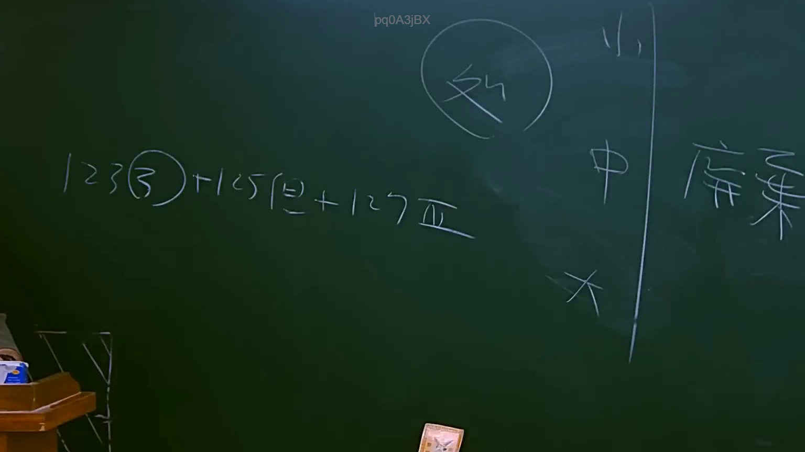

# 🎥 影音教材板書校對筆記
    - **來源影片**: [預約 11 2025-07-24 13-18-51-359](file:///J:/行政法A/ch11/預約 11 2025-07-24 13-18-51-359.mp4)
    - **課程分類**: `[行政法A`
    - **課堂章節**: `ch11]`
    - **影片時間戳記**: `01:02:45` (3765 秒)
    - **板書類型**: `影音板書`
    - **偵測時間**: 2026-07-22 05:35:42
    
    ## 🔍 擷取黑板板書對照圖
    
    
    ## 🧠 AI 智慧理解與知識庫演化註記
    ：
1. 板書文字辨識：
   - 左側核心法條：123③ + 125(但) + 127Ⅳ
   - 上方圈選關鍵字：「外」（通常指「外國」或「外部關係」，在此情境下常涉及國際私法或涉外民事法律適用法）
   - 右側分級表：小、中、大
   - 最右側關鍵字：「席棄」（應為「放棄」或相關法律行為用語的簡寫，如「拋棄」）

2. 法律學理與法條對照：
   - 民法第123條第3項：涉及消滅時效完成後之效力或相關抗辯權。
   - 民法第125條：一般請求權之消滅時效為十五年，板書註記「(但)」意指應參照第125條但書（若法律另有規定則從其規定）。
   - 民法第127條第4項：關於職業薪資、運送費等兩年短期時效之特殊規定。
   - 邏輯解讀：此板書展示了法律實務上處理「消滅時效」的層次邏輯。老師透過「小、中、大」的架構，說明在解決法律問題時，應先審視具體請求權的短期時效（127條），再確認是否有排除或替代的一般時效規定（125條），最後檢視時效完成後的法律效果（123條）。「外」可能暗示此邏輯在涉外民事法律關係下的變動，或為針對特定案件的分類提示。
    
    ## 📊 可編輯之 Mermaid 關係流程圖
    ```mermaid
    ：
graph TD
    A["消滅時效適用邏輯"] --> B["短期時效 (127條第4項)"]
    A --> C["一般時效 (125條但書)"]
    A --> D["時效效果 (123條第3項)"]
    B --> E["處理權利優先性"]
    C --> E
    D --> E
    F["外國/外部因素"] -.-> A
    G["階層分析"] --> H["小：具體事實"]
    G --> I["中：適用條文"]
    G --> J["大：法律原則"]
    J --> K["放棄/拋棄權利"]
    ```
    
    ## ✍️ 操作者手動校對修改區
    <!-- 您可以直接修改上方的文字或調整 Mermaid 區塊中的節點，Obsidian 會即時重新渲染 -->
    - [ ] 欄位結構與法律邏輯已校對無誤。
    - **校對筆記**: 
    